Trong năm 2019, đã có hơn 2 nghìn bài viết được chia sẻ tới hơn 3 trăm nghìn designer trên toàn thế giới (uxdesign.cc), và dưới đây là những dự đoán về các xu hướng sẽ diễn ra trong năm tới. Mọi người có thể đối chiếu với bài viết gốc [tại đây](https://trends.uxdesign.cc/).

# Thiết kế cho thời đại hậu sự thật

Trong bối cảnh mà những video deepfake, thông tin sai lệch được lan truyền rộng rãi với nhiều mục đích khác nhau. Người làm thiết kế trong môi trường sản phẩm số cần phải sử dụng khả năng của mình để đưa ra những thiết kế mang tính minh bạch và khích lệ người dùng sử dụng kỹ năng tư duy phê phán vấn đề.

Có thể thấy rằng Facebook đang làm khá tốt điều này (ngoại trừ nghe lén), họ đã đưa cảnh báo cho người dùng về những thông tin không đúng sự thật nhưng không tự ý xóa nó mà để người dùng tự quyết định cách họ tiếp nhận thông tin đó.

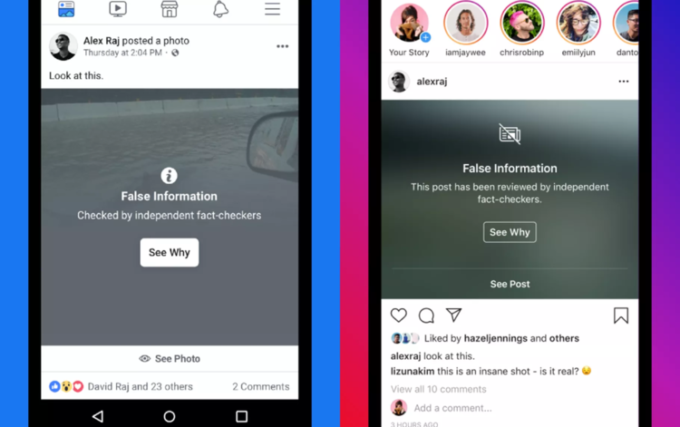

Hay là việc Youtube cho phép người dùng biết ai, tổ chức nào đứng sau, tài trợ cho những video liên quan đến chính trị, giúp người dùng có thêm thông tin và xử lý nó một cách khách quan hơn.

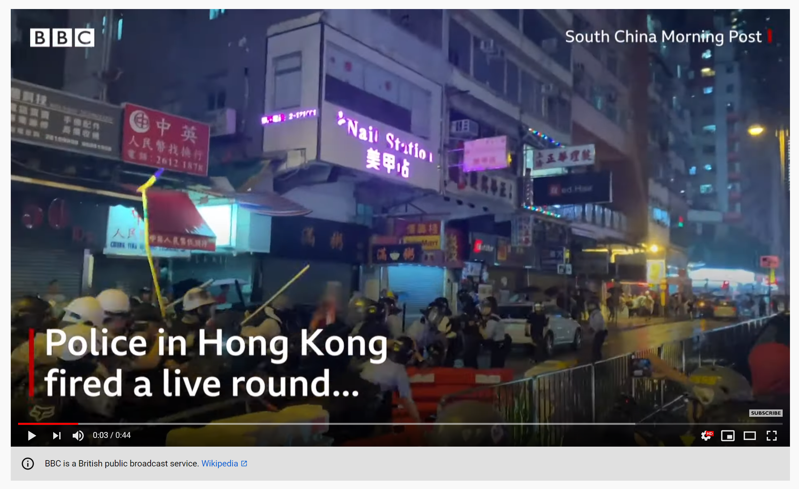

### Thiết kế cho sự minh bạch

Chúng ta đang sống trong một thời đại mà sự thật bị xé nhỏ thành nhiều mảnh, có ít nhất 70 quốc gia đang phải chịu ảnh hưởng của những thông tin không đúng sự thật.

> Các công ty cần tạo ra sự thay đổi để đấu tranh lại những tác hại của việc sai lệch thông tin — nhưng họ cần phải làm thế nào?

Axios là một trong những công ty mới đã bắt đầu việc tái định hình cách cung cấp thông tin thông qua những bài viết. Họ đưa ra thông tin đa chiều và không phán xét, để người dùng tiếp nhận thông tin một cách chủ động. Google và Adobe cũng không đứng ngoài cuộc chiến này, kẻ thù còn tinh vi hơn — những video deepfake, những bức ảnh đã bị chỉnh sửa.

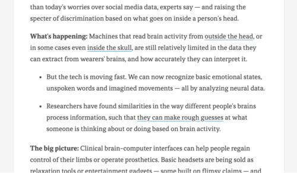

### Con sâu làm rầu nồi canh

Cũng bởi vì sự tràn lan của những thông tin sai sự thật, người dùng dần trở nên thận trọng hơn và nghi ngờ mọi thứ họ thấy trên mạng. Điều này đã khiến cho các công ty phải cẩn trọng hơn trong việc lấy lòng tin từ người dùng cũng như ngăn chặn thông tin sai sự thật.

Năm 2020 sẽ là một năm có nhiều khó khăn và trách nhiệm đối với những người làm thiết kế sản phẩm: tạo ra những công cụ để lọc nội dung lừa đảo, giúp người dùng tránh xa khỏi mặt xấu mà công deepfake mang lại, ngăn chặn lan truyền thông tin sai sự thật. Và quan trọng hơn hết, chúng ta cần phải có trách nhiệm trong việc giúp đỡ chính tổ chức của mình nâng cao nhận thức phòng ngừa, xây dựng những nguyên tắc xoay quanh sự thật.

# Sự phát triển của những cộng đồng vi mô

Cộng đồng vi mô là những nhóm, tổ chức nhỏ được xây dựng với mục đích kết nối những người có cùng nhu cầu chia sẻ, học hỏi về một lĩnh vực nào đó. Cộng đồng vi mô đang dần thay thế sứ mệnh của diễn đàn — những cộng đồng trực tuyến to lớn từng nổi lên trong quá khứ. Xây dựng mô hình cộng đồng kiểu này không đòi hỏi những yêu cầu phức tạp về cả con người cũng như công nghệ, chỉ cần gặp gỡ và nói chuyện với những người xung quanh là có thể xây dựng được thành một nhóm — một công đồng vi mô.

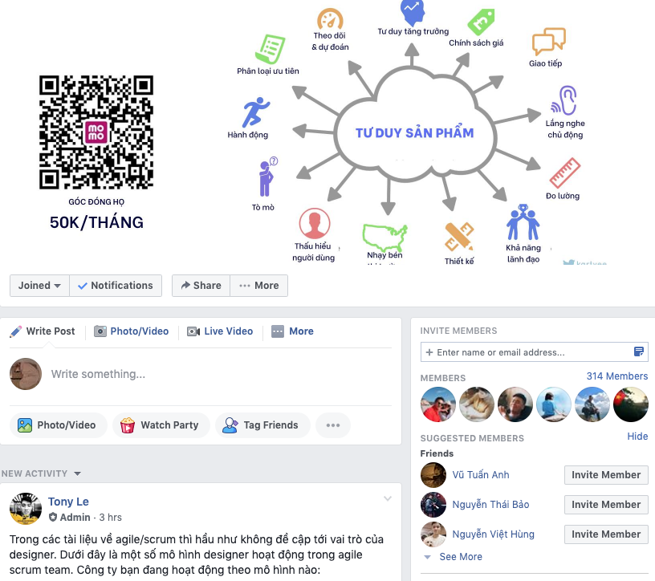

Những cộng đồng trực tuyến lớn, có sự tham gia của hàng nghìn thành viên giờ không mang lại hiệu quả cao, các thành viên không tìm được điểm chung để có thể tiếp tục phát triển cộng đồng. Bạn sẽ chỉ thấy loanh quanh có vài người hoạt động sôi nổi hay thỉnh thoảng là những bài viết mang tính chất tuyển dụng, quảng cáo. Các chủ đề cũng không được đào sâu vì thường bị mất kết nối giữa các thành viên với nhau.

> Khi mà những cộng đồng lớn tập trung vào việc giới thiệu, thu hút người mới thì chúng ta cần xây dựng những cộng đồng nhỏ để phát triển bản thân và thu nạp đầy đủ giá trị của những cuộc trao đổi.

### Sự chuyển biến của thiết kế trực tuyến

Những thay đổi về cách mọi người hoạt động trong cộng đồng không có nghĩa là con người ngừng việc trao đổi 1-1 với nhau. Chỉ là, họ đang tìm đến nhau một cách chủ động hơn thông qua những kênh Slack, Telegram hay nhắn tin trực tiếp. Việc trao đổi 1-1 vẫn diễn ra, nhưng nó xảy ra ở những nhóm nhỏ thay vì những diễn đàn lớn.

Sự chuyển biến như vậy cũng đang xảy ra đối với cách tổ chức sự kiện. Khi mà các hội thảo lớn vẫn diễn ra nhưng với mục đích kết nối thì những buổi gặp gỡ nhỏ lẻ lại tập trung sâu hơn vào việc học hỏi và phát triển bản thân, vì nó cho phép chúng ta tiếp cận những câu hỏi, đón nhận những câu trả lời chân thật nhất. Trong năm 2020, các cuộc trao đổi sẽ diễn ra một cách tập trung hơn, bản địa hóa và chân thật hơn.

# Thiết kế với tư cách là sự hợp tác

Hình mẫu "cân team" sẽ không còn nữa, thay vào đó là sự trao đổi và làm việc nhóm. Các thành viên sẽ có cơ hội học hỏi từ nhau và phát triển nhanh hơn khi mà càng ngày độ phức tạp của những dự án càng lớn.

### Không ai nhảy tango một mình

Tại những công ty nhỏ, người làm thiết kế thường phải đảm nhiệm mọi vai trò trong quy trình thiết kế sản phẩm, đồng thời phải tạo ra văn hóa thiết kế cho tổ chức đó. 

Ở một góc nhìn khác, làm thiết kế tại những công ty lớn chỉ là một phần nhỏ trong tổ chức. Họ chỉ được đối mặt với những thách thức mà chính sản phẩm của họ mang lại, sự hợp tác vẫn chưa thực sự được đề cao ở nơi đây: làm thiết kế thì không được tham gia vào chiến lược của sản phẩm, không nắm được cách lập trình viên triển khai thiết kế của mình,...

> Hợp tác đòi hỏi những quy tắc, không phải những vị trí.

Nhiều người vẫn nghĩ thiết kế là đêm diễn của một nghệ sĩ và né tránh làm việc với những thành viên khác, và cuối cùng thì sản phẩm vẫn chỉ là những thành kiến của một con ếch ngồi đáy giếng.

### Người làm thiết kế cần phải biết đón nhận

Nếu mọi người liên tục đòi hỏi bạn sự rõ ràng của những tài liệu, hay họ cảm thấy quy trình của bạn đang ép việc họ thì đây là những tín hiệu để bạn biết mình cần phải dừng lại và hành động như một người dẫn đường, xem xét lại quy trình của bạn theo một cách khác.

- Nghiên cứu người dùng kỹ càng hơn, có bài bản hơn để giúp cả nhóm hiểu rõ hơn về người dùng, về sản phẩm mình đang xây dựng.
- Một bản mô phỏng dù tĩnh hay động cũng có thể là một cách để bạn làm việc với nhóm lập trình viên dễ dàng, hiệu quả hơn và đem lại trải nghiệm cao cấp hơn cho người dùng.
- Luôn đưa ra góp ý cũng như đón nhận từ mọi người, có thể dùng theo cả 2 cách là ngẫu hứng hay có tổ chức.

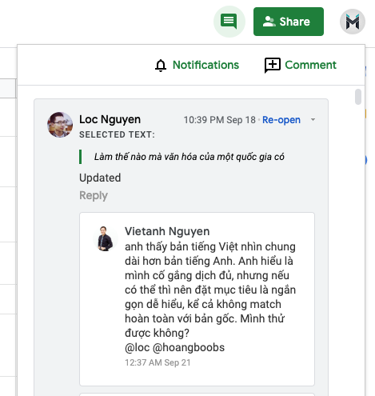

Thiết kế không chỉ là đồng cảm với người dùng, mà còn là đồng cảm với tất cả những con người bạn đang làm việc cùng để giúp nhau phát triển, giúp tổ chức đi lên. Ở năm 2020 tới, chúng ta cần trở nên rộng mở hơn để đưa cả nhóm đến những mục tiêu chung.

# Làm việc có chủ đích

Thêm một tính năng mới vào sản phẩm thì không hề khó, nhưng cái khó là giải quyết đúng vấn đề cho đúng người, đúng thời điểm.

Một sản phẩm nên bắt đầu từ những thứ nhỏ và tập trung vào nó. Các cụ đã dặn, một nghề cho chín còn hơn chín nghề. Đó là lý do chính sẽ dẫn dắt bạn đến thành công.

Nhưng, bằng một số lý do nào đó thì chúng ta vẫn thường quên lời dặn này:

- Người dùng luôn đòi hỏi tính năng mới và nhóm thiết kế sản phẩm luôn cố gắng đáp ứng nó.
- Cấp trên tạo áp lực về sự tăng trưởng của sản phẩm, mặc kệ đội ngũ đang tìm mọi cách để tăng doanh thu.
- Hiệu suất làm việc của đội ngũ thiết kế sản phẩm đang được đo lường bằng tần suất tính năng mới được mang đến tay người dùng.

Và thường thì sau khi thêm quá nhiều tính năng, chúng ta không thể quay trở lại được nữa. Giá trị ban đầu của sản phẩm bị pha loãng, những trải nghiệm tệ của sản phẩm trở nên phức tạp và mất đi ý nghĩa đối với người dùng.

> Thiết kế là sự thể hiện của ý định

Khi chúng ta đối mặt với một vấn đề, thứ đầu tiên mà chúng ta nghĩ tới là xây thêm một tính năng để giải quyết vấn đề đó. Thứ chúng ta sẽ nhận được là hàng trăm, hàng nghìn dòng lệnh vô nghĩa nằm sâu trong sản phẩm.

> Những người được tán dương vì đưa ra tính năng mới thường coi việc mất đi một người dùng như là sự thất bại. Với họ, thiết kế chỉ đơn giản là một tổ hợp của các tính năng.

### Một sản phẩm tốt khi nó làm ít

Tập trung vào mục tiêu cốt lõi của sản phẩm là một điều không hề đơn giản nhưng không phải là bất khả thi. Hi vọng ở năm 2020, chúng ta sẽ trở nên có chủ đích hơn trong việc thiết kế sản phẩm. Công việc của chúng ta là giải quyết các vấn đề, nhu cầu của người dùng chứ không phải là khiến lập trình viên trở nên bận rộn hơn. Điều này có nghĩa là phải quan tâm nhiều hơn tới người dùng và sự ảnh hưởng của công việc chúng ta đang làm thay vì chỉ quan tâm đến mỗi công việc.

# Kỷ nguyên của việc lưu trữ đã chấm dứt

Còn nhớ ngày Google Docs ra đời vào năm 2006, cách chúng ta làm việc với mọi người đã thay đổi, không còn việc gửi tệp tin đính kèm theo mỗi email nữa và giờ thì điều đó cũng đang xảy ra đối với những tài liệu thiết kế.

Có thể nói đây là một sự chuyển biến tương đối buồn vì cách đặt tên cho tài liệu chính là thứ mà các nhà thiết kế thích thú và cảm thấy hài hước nhất bởi cách mà mỗi người quản lý tài liệu lại khác nhau.

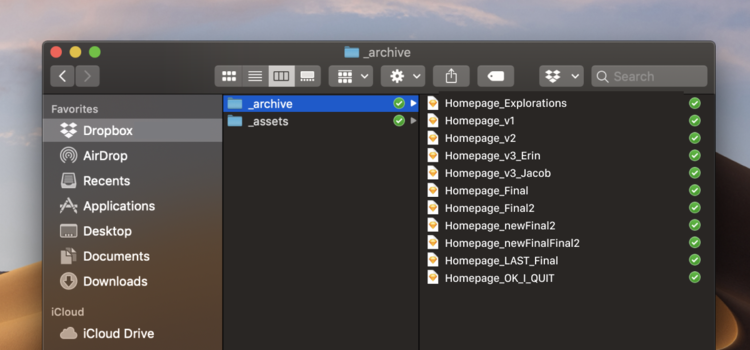

Từ năm 2019, chúng ta có thể nhận ra những nhà thiết kế đang dần thiết kế với ít tài liệu ngoại tuyến hơn. Không phải do khối lượng công việc giảm hay họ quản lý các phiên bản tốt hơn mà bởi vì đã có nhiều hơn những công cụ hỗ trợ việc tạo, chỉnh sửa, lưu trữ tài liệu trực tuyến: Dropbox Paper cho việc lưu lại ý tưởng hay, Google Spreadsheet cho việc xác định chiến lược và kế hoạch, Notion cho việc tổ chức thông tin của dự án, Whimsical cho việc thiết kế nháp và các luồng thao tác, cuối cùng là Figma cho việc thiết kế giao diện.

### Đầu ra không phải là một tệp tài liệu thiết kế

Để mà nói thì năm nào chúng ta cũng thấy một danh sách các công cụ mới được liệt kê, năm vừa rồi cũng không phải ngoại lệ nhưng có một điều mới là: các công cụ đang chuyển hướng sang việc tập trung vào sự hợp tác giữa các thành viên trong dự án nhiều hơn là xây dựng tính năng một cách đơn thuần.

> Sản phẩm của những người làm thiết kế không chỉ là những bản thiết kế mà chúng ta nhìn thấy hàng ngày, nó còn là mỗi quyết định mà cả một đội ngũ phải hợp tác, thống nhất với nhau.

Lý do chính mà chúng ta đang làm công việc thiết kế là để chia sẻ nó với các sếp, các bên liên quan, quản lý dự án, lập trình viên, khách hàng. Vì thiết kế là sẻ chia.

> Điều gì sẽ xảy ra nếu một bản thiết kế được hoàn thiện nhưng nó chẳng được chia thẻ với đội ngũ?

### Sự hợp tác

Sẽ còn mất nhiều thời gian để tất cả những người làm thiết kế hiểu và chấp thuận ý tưởng của việc thiết kế không cần đến tập tin ngoại tuyến nào. Có thể dễ dàng nhận ra những công cụ tạo được tiếng vang lớn trong cộng đồng thiết kế và trội hẳn lên đều có một công thức thành công chung là đem lại khả năng phối hợp cho mọi người.

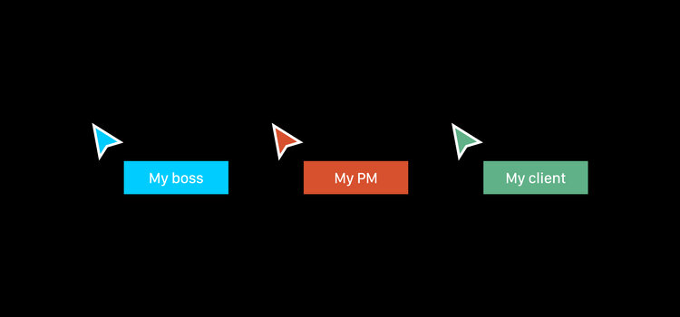

### Phá vỡ những rào cản

Ngày nay các công cụ đều dựa trên nền tảng web, mở ra một chân trời rộng cho cách làm việc đề cao sự hợp tác. Khi mà người làm thiết kế không còn là nhân vật chính duy nhất nữa, chúng ta có thể dễ dàng đưa những thành viên khác vào chung quy trình thiết kế. Giá trị của chúng ta — những người làm thiết kế không còn là việc có khả năng thay đổi nội dung thiết kế, chúng ta có thể tập trung hơn vào những sự thay đổi trong những thiết kế đó.

Có thể một số người sẽ vẫn cảm thấy không thoải mái khi để nhiều người khác nhìn vào thiết kế của mình, nhìn vào cách họ đang làm việc một cách trực tiếp. Nhưng rồi họ sẽ nhận ra những lợi ích của cách làm việc theo thời gian thực như thế này và bỏ qua những sự không thoải mái kia sang một bên.

Năm 2020 sẽ là một năm mà những người làm thiết kế sẽ tập chung và những công cụ có thể giải quyết được vấn đề về cách hợp tác, giúp họ đạt được những mục tiêu lớn.

# Tái kiến trúc thông tin

Khi mọi thứ đều số hóa thì đây là lúc chúng ta cần tìm những cách thức mới để trình diễn hệ sinh thái số mà chúng ta tạo ra.

### Phát triển nhanh khiến chúng ta lộn xộn hơn

Nhìn thử vào cách mà các công ty đang dẫn dắt người dùng bằng những dịch vụ từ những dịch vụ trực tuyến đến vận chuyển đồ ăn, càng ngày mọi thứ càng phức tạp đối với người dùng hơn.

Để hiểu và thiết kế được những khối thông tin phức tạp nhwu vậy là một điều rất quan trọng: "Người làm thiết kế phải hiểu những khía cạnh và cách mô hình kinh doanh dẫn giải cấu trúc thông tin nếu chúng ta muốn làm thiết kế một cách có đạo đức."

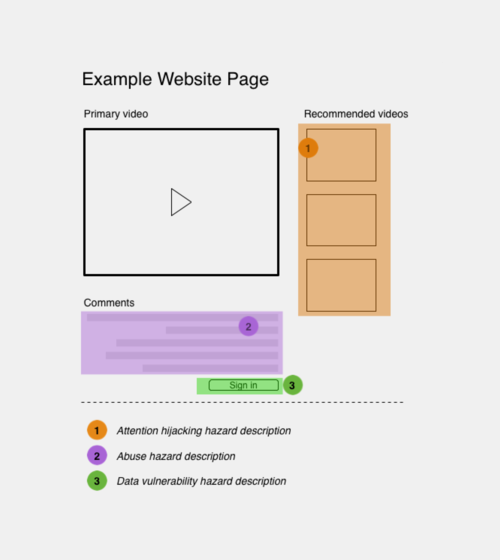

> Cấu trúc thông tin là cách chúng ta sắp xếp các phần thông tin lại để làm nó  dễ hiểu hơn.

Cấu trúc thông tin là nền tảng của việc thiết kế số. Khi mà thị trường càng ngày càng khốc liệt, áp lực của việc ra mắt sản phẩm sẽ đẩy các doanh nghiệp đến việc đạo nhái cấu trúc thông tin của những đối thủ. Động lực để khắc phục các vấn đề trên cũng không cao vì nó đòi hỏi rất nhiều công việc phụ trợ và họ cũng không nhận ra được giá trị hay lợi ích gì để phải đầu tư thời gian, con người cho việc đưa ra cấu trúc thông tin cho riêng mình.

### Kiến trúc của mọi thứ

Bước vào năm 2020, mọi thứ bắt đầu thay đổi khi môi trường thông tin trở thành yếu tố chính của tất cả các tổ chức làm trong lĩnh vực số. Các công ty, tổ chức cần nhắm vào việc đưa ra thông tin có ích, dễ dùng và mạch lạc vì đây là chiến lược then chốt trong công cuộc số hóa.

Chúng ta cần trau dồi khả năng trình diễn để biến những thông tin của một sản phẩm trở nên có ý nghĩa hơn, vì một bức tranh lớn hơn là chỉ tập trung vào giao diện.

# Nắm lấy những sức mạnh mới

Giờ là lúc những tranh luận về việc ai làm thiết kế, ai không nên chấm dứt. Trải nghiệm người dùng là một ngành đang phát triển và chúng ta cần đem hết những tinh túy, sức mạnh của tất cả mọi người vào để đem đến trải ngiệm tốt cho những người cần đến nó.

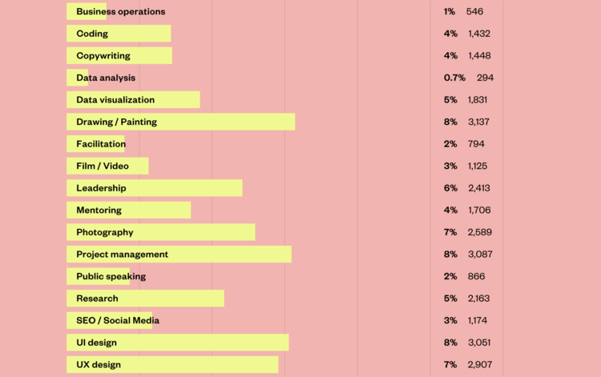

Mỗi khi có một chức vụ mới liên quan đến trải nghiệm người dùng, chúng ta thường thấy cộng đồng có 2 cách phản ứng. Ví dụ như khi có một nghề mới mang tên Thiết kế trải nghiệm cho phim ảnh:

- Phản đối: Mày không thể chỉ làm chỉnh sửa video mà lại gọi mình là một người thiết kế trải nghiệm được.
- Ngạc nhiên: Ơ thế tao có cần phải học chỉnh sửa video nữa không nhỉ?

Chúng ta thường bị lo sợ rằng một ai đó biết rộng hơn sẽ đá đít chúng ta khỏi cái ngành này, hay là bị ngạc nhiên và nghĩ rằng mình cần phải cập nhật những kỹ năng mới để bắt kịp mọi người.

> Bạn có thể trở thành một người thiết kế giỏi với khả năng biết rộng nhưng không phải ai cũng cần có những kỹ năng giống nhau để trở thành một người giỏi.

### Chia rẽ làm chúng ta kém đi

Không có công thức nhuộm đầy phép màu nào cho quy trình thiết kế hay kể cả tiêu chuẩn của vũ trụ, chúng ta không thể để những cái mác làm ranh giới giữa mọi người. Thay vì thế thì chúng ta nên hỏi học từ mọi người, đừng để cái ngành này bị chia sẻ mà hãy kết nối mọi người lại.

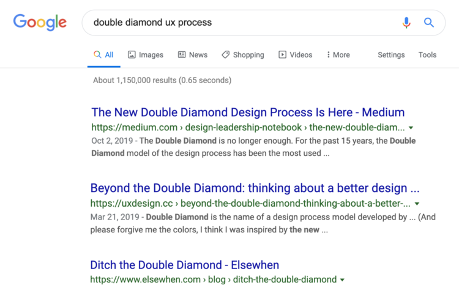

### Mở rộng khiến chúng ta giỏi hơn

Nếu bạn có thời gian để học càng nhiều thứ từ mọi thứ xung quanh bạn, đó là một điều tích cực. Hi vọng vào năm 2020, chúng ta rộng mở hơn với nhữ kỹ năng mới để phát triển bản thân thay vì đi tìm câu trả lời cho việc ai làm thiết kế, ai làm lập trình.

# Hệ thống thiết kế vô hình

Ta có thể đã gặp khái nghiệm hệ thống thiết kế ở mọi nơi, mọi lúc: tham dự hội thảo, đọc bài viết, tham gia các khóa học,... Hệ thống thiết kế thực sự là một cách rất tốt để mở rộng sản phẩm, nhưng chúng ta lại chỉ quan tâm đến bề nổi (cái thư viện) mà bỏ quên phần chìm của tảng băng — thứ mà có thể coi là giá trị vô hình của hệ thống thiết kế.

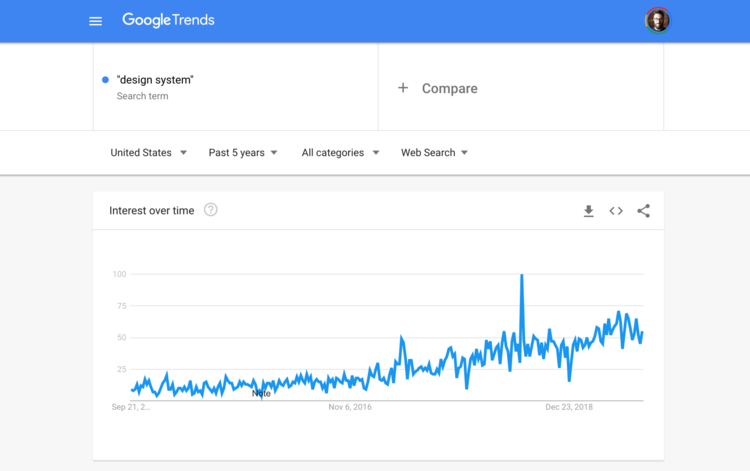

Hệ thống thiết kế mang lại nhiều giá trị dễ nhìn thấy, từ những quan điểm về trải nghiệm như việc thiết kế có sự đồng nhất ở giao diện sẽ tạo sự quen thuộc cho người dùng đến những quan điểm về kỹ thuật như tái sử dụng các thành phần trên giao diện giúp tăng năng suất, độ hiệu quả, giảm bớt công sức cho các lập trình viên.

### Hệ thống thiết kế không chỉ là thư viện giao diện

Thứ đầu tiên xuất hiện khi nhắc về hệ thống thiết kế có lẽ là thư viện gồm những thành phần có thể tái sử dụng: một kho lưu trữ những thành phần được dùng để tạo nên thiết kế. Nhưng đó chỉ là phần nổi, một hệ thống cần phải xem xét đến các khí cạnh rộng hơn trong hoạt động của công ty, bao gồm các công cụ, cách quản trị, con người, cách tiếp cận, các công nghệ và quy trình làm việc.

Đó là lý do tại sao người làm thiết kế cần nghĩ đến hệ thống thiết kế như là những thực thể sống mà có thể kết nối cả tổ chức.

> Hệ thông thiết kế, quản trị thiết kế và thư viện thiết kế là ba dự án khác nhau với ba cách tiếp cận khác nhau. Một thứ sẽ không giải quyết được tất cả.

### Hệ thống thiết kế là sự phản ánh của giá trị công ty

Hệ thống thiết kế xoay quanh con người: cách mọi người tương tác, hiểu nhau và cách họ làm việc cùng nhau để đạt được một mục tiêu chung. Nó là thứ được tạo ra bởi con người, sử dụng bởi con người và trải nghiệm bởi con người. Thức thách cũng từ con người mà ra và nó có thể  bị phá hỏng bởi con người. Trách nghiệm của chúng ta là chuyển từ vai trò của người tổ chức, thực thi sang vai trò của những nhà nghiên cứu, nghiên cứu về con người.

> Trước khi xét đến màu sắc nào phù hợp cho nút bấm, chúng ta cần xét đến những giá trị mà công ty chúng ta đang nắm giữ.

Nếu chúng ta không quan tâm đến những giá trị công ty đang theo đuổi thì có thể chúng ta sẽ bỏ quên những người mà sẽ không bao giờ được ta quan tâm đến nữa. Ở năm 2020, chúng ta nên dành ít năng lượng cho việc tạo ra những thứ mới trong hệ thống thiết kế và hãy tập trung vào việc hiểu cái hệ thống đằng sau những thiết kế.

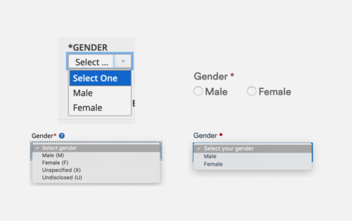

# Hãy đoàn kết

Internet đã trở thành một nơi mà bất cứ ai cũng có thể tranh luận và ném đá xối xả vào mặt người khác, và cộng đồng làm thiết kế cũng không khá hơn.

### Chúng ta có nhiều thử thách lớn hơn cần giải quyết

Chúng ta đều có chung mục tiêu là tạo ra những sản phẩm mà ta tự hào về nó, thứ cải thiện cuộc sống con người và đưa nền kinh tế lên cao. Có thể là ta không đồng ý với những chiến lược, cách làm của người khác nhưng mà nhìn rộng hơn thì những tranh luận này đang tiêu tốn rất nhiều năng lượng trong khi ta có thể dùng nó để làm những việc có ý nghĩa hơn.

> Chiến đấu để bảo vệ ai mới là người thiết kế đúng chẳng làm chúng ta mạnh hơn. Tại sao phải đấu đá lẫn nhau thay vì chiến đấu lại những thế lực lớn hơn, có hệ thống hơn, những người có tác động tiêu cực đến thế giới?

Nếu chúng ta không kết thúc nó, chẳng ai làm thay cả. Đây chính là lúc để chúng ta xắn tay áo lên — năm 2020 là năm để chúng ta đặt những hiềm khích sang một bên và bắt đầu hành động, gặp gỡ những người làm thiết kế khác để trao đổi về ý nghĩa của việc thiết kế, đoàn kết với mọi người hơn.

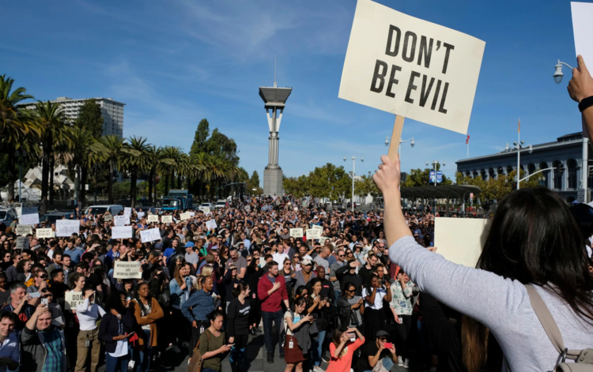

Chúng ta cần biết rằng lạc quan chính là chìa khóa để giải quyết mọi vấn đề. Nếu ta không tin rằng ta có thể sửa chữa thứ gì đó, chúng ta không thể trở thành người làm thiết kế.

> Thiết kế là sự lạc quan. Nó mang lại nhều thứ mới mẻ cho thế giới. Người làm thiết kế đón nhận vấn đề, nhào nặn, đóng khung nó và tạo ra những cách để giải quyết thông qua nhiều cách.

Lạc quan là cách duy nhất để tiến về phía trước, hãy tập trung vào những hành động thực tế và biết cách biến sự thất vọng thành động lực để tạo ra những điều tốt đẹp hơn cho thế giới.