Vừa rồi, mình bất ngờ được anh [Việt Anh](https://www.facebook.com/vietanh) mời tham dự một buổi gặp mặt bí mật cuối năm Bính Tuất cùng với nhiều độc giả khác của trang [uxlagi.com](https://l.facebook.com/l.php?u=http%3A%2F%2Fuxlagi.com%2F%3Ffbclid%3DIwAR3Bdu6yGqJJDU0xen7o94NguSftUeIkYz44XEQsOvoBwk2dHU1xXnkClQU&h=AT0uYwWwkqpbJCNUH9U0-nJSLPSKJxLs5GGFxeB5PTI92kHZJGIn34zqtft4exJhYZAPsB_e6agSoGr2iLQ7fdHRTjJhMQIjuZ2VhNd8J3i0MuhjO7-_Ydx3sRD81iEDjgPcf1wpB0Y). Bất ngờ hơn nữa, nội dung của buổi gặp mặt hôm ấy không phải là về thiết kế trải nghiệm người dùng, về xu hướng thiết kế sắp tới, về những câu chuyện làm việc tại Google mà lại là về một chủ đề hết sức gần gũi, đó là Thiết kế phong cách Việt Nam.

Ấn tượng đầu tiên của mình với anh Việt Anh là anh ấy mặc một chiếc áo dài trông rất Việt Nam, nhìn bảnh phết! Bắt đầu buổi gặp mặt, anh kể về những chuyến đi du lịch, gặp gỡ những người cùng làm về thiết kế từ nhiều đất nước khác nhau, Mexico là một ví dụ. Câu chuyện về chuyến đi được dẫn dắt chậm dãi, điếm nhấn là những cuộc nói chuyện với những chuyên gia thiết kế bản địa nhằm tìm hiểu phong cách thiết kế tại đất nước này. Anh ấy rất cẩn thận chụp ảnh lại để làm tư liệu cũng như mang ví dụ về tận Việt Nam để chia sẻ cho mọi người

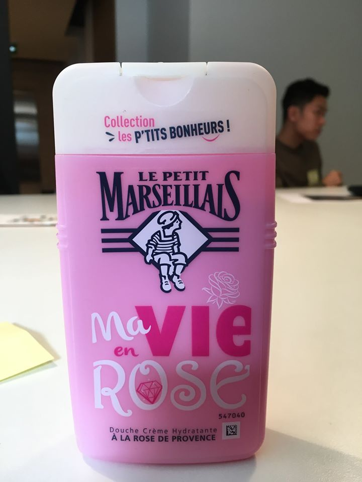

Một chai dầu gội đầu sản xuất tại Pháp được anh Việt Anh mang về để làm ví dụ cho thiết kế đẹp, mang chất "Pháp".

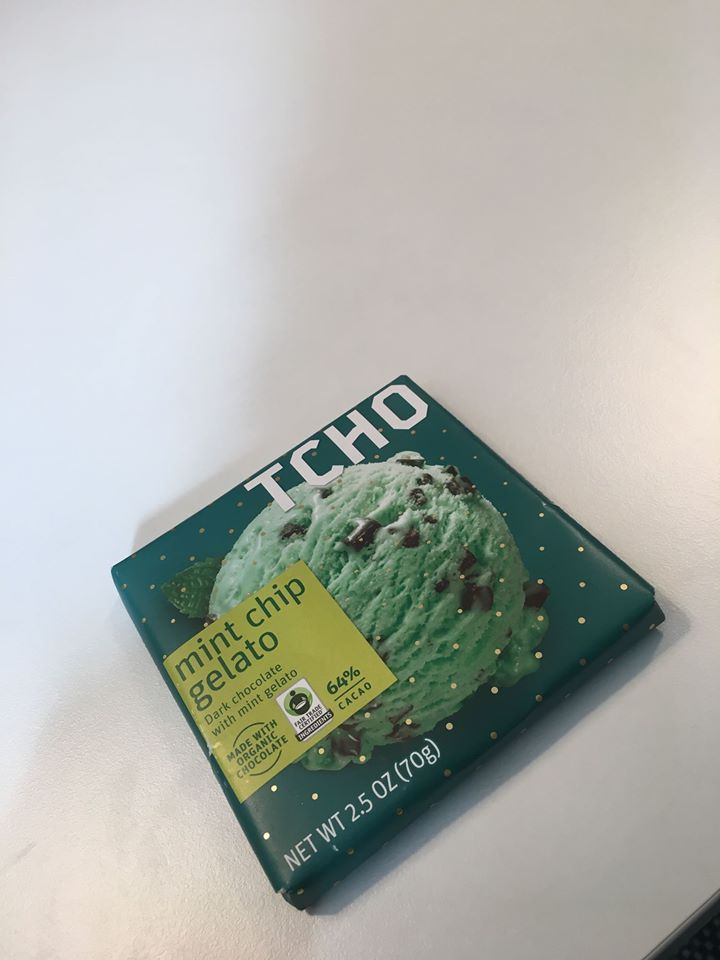

Thiết kế bao bì của một phong kẹo sô cô la. Nhìn đã muốn mua rồi!

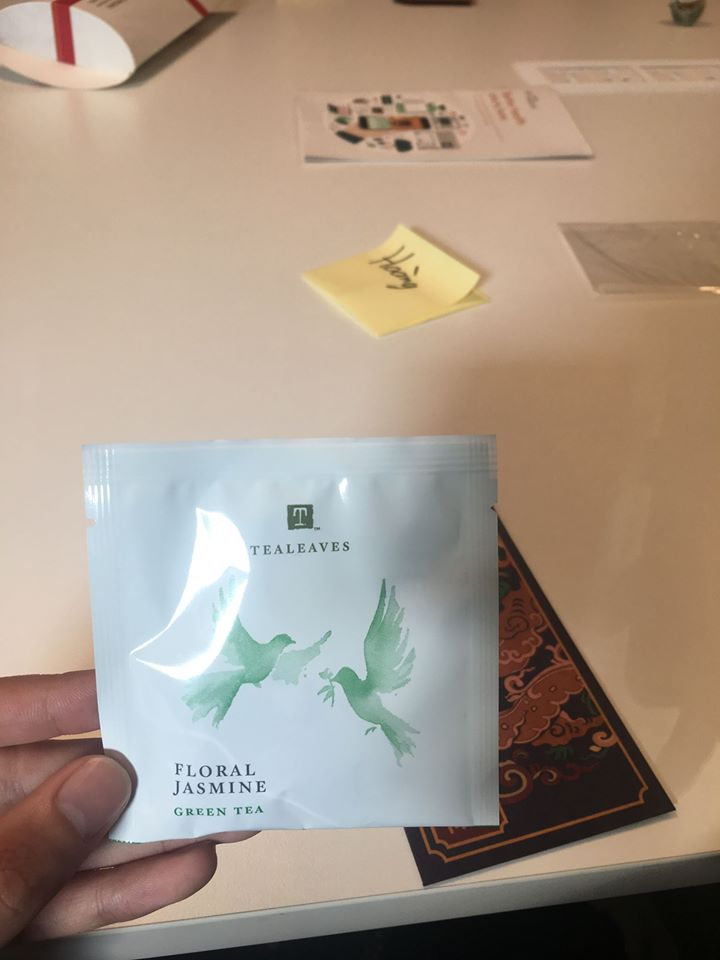

Thiết kế của một gói trà tại Google nhưng lại không có hình ảnh trà. Đặc trưng của thiết kế hiện đại, tối giản!

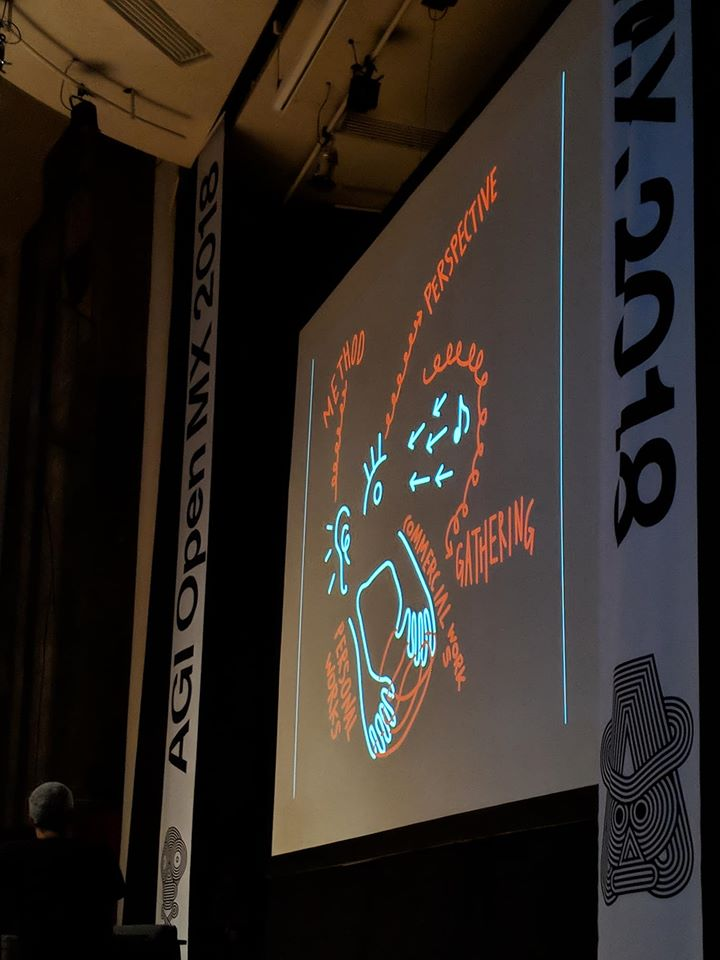

Thiết kế của một cô gái bị trầm cảm người Hàn Quốc kể về cách cô ấy tiếp nhận thông tin. Ảnh do anh VA chụp.

Thứ cô đọng lại nhiều nhất trong trí nhớ của mình về câu chuyện của anh Việt Anh là cách người bản địa Mexico sử dụng những hình ảnh rất gần gũi trong các thiết kế của họ, có thể kể đến việc sử dụng hình ảnh cây ngô trong bức tranh ở một nhà hàng nổi tiếng, ngô là một sản vật mà theo như anh Việt Anh chia sẻ là "quốc hồn, quốc túy" của nơi đây. Hay là hình ảnh chiếc bánh Taco được làm khác biệt đi bằng việc kết hợp với một thứ lá gần gũi với người dân ở Mexico. Qua đó mình nhận ra, thiết kế nội địa chẳng phải là thứ gì to tát, nó đều bắt nguồn từ những hình ảnh hết sức đơn giản, mang đậm nét văn hóa, lịch sử bản địa. Nhắc lại lời của anh [Tony Le](https://www.facebook.com/quang.phowr?eid=ARDdFfye9gAnBt9Dhu0F9QOONei9Q1T-Rovs4swm9VyW5i_5l4HBvN5iMlp7K6CYLSwmkPWpee0CEX6l), cách áp dụng như thế này gọi là "same same, but different".

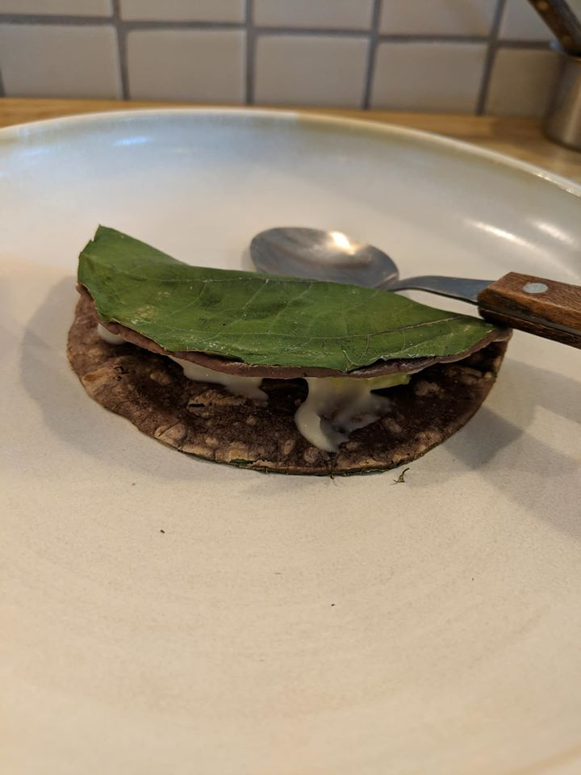

Chiếc bánh Taco này sẽ không có gì đặc biệt nếu không được phủ lên một lớp "áo" làm từ loại lá mang đậm văn hóa Mexico. Ảnh do anh VA chụp.

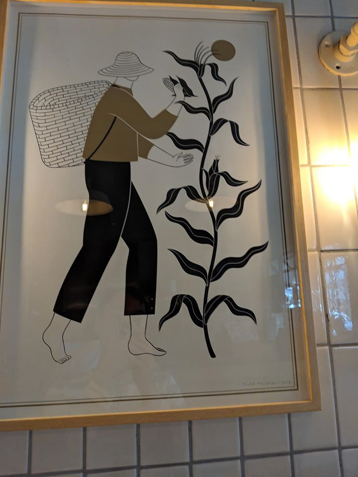

Quốc hồn, quốc túy của người Mexico. Ảnh do anh VA chụp.

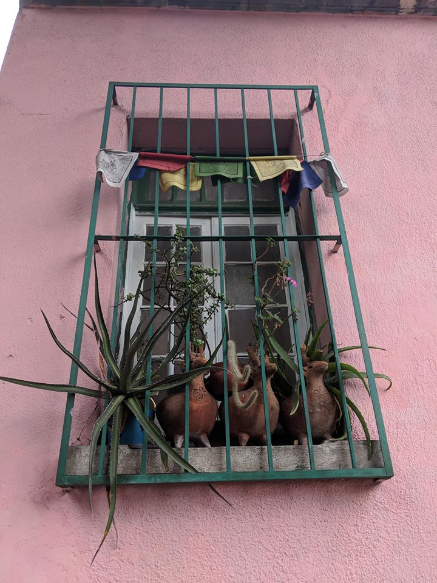

Chậu cây với những hình thù lạ mắt ở Mexico. Ảnh do anh VA chụp.

Tiếp nối câu chuyện, anh Việt Anh chia sẻ về mong muốn đưa Việt Nam trở thành một cường quốc về Thiết kế. Điều này có thể tốn nhiều thời gian để trở thành hiện thực, nhưng nó hay ở chỗ "người Việt Nam, nói là làm", những câu chuyện, những kiến thức chuyên môn kết hợp với ví dụ thực tế vẫn được chia sẻ liên tục trên trang [uxlagi.com](https://l.facebook.com/l.php?u=http%3A%2F%2Fuxlagi.com%2F%3Ffbclid%3DIwAR0JMHfmcrqqSOa3mF6jG5ly9-A1nxMH5sSLyx5XEZU_8IzGarAuAGkdyvw&h=AT2pc89-vpHPQ2OTXvgIJw61ME2s5w9yNU5KJrQXa3xoytl6xumbTGA3KQh5s22phPET_GBTKxJy1gyW4uXZLTDyzA7CPbjLGXAWeDitM45A9Oz46_oqQ8E9o2VNfzUPd7koGsY8g7s).

# Làm sao để thiết kế mang phong cách Việt Nam?

Điều đầu tiên là mọi người đều phải sử dụng Tiếng Việt, mặc dù trong khán phòng hôm đó không ít người đang làm việc với công ty nước ngoài. Rất nhiều người làm về thiết kế ở Việt Nam đều cho rằng Việt hóa từ ngữ chuyên môn khiến nó thô kệch, khó hiểu, nhưng một người làm việc tại Google lâu năm như anh Việt Anh còn không ngần ngại gì thì sao chúng ta cứ phải tự ti về văn hóa Việt, phải không nhỉ? Buổi chia sẻ đó vẫn diễn ra rất suôn sẻ là đằng khác.

Sau đó, tất cả mọi người trong khán phòng được làm một bài khảo sát nho nhỏ, mỗi người cầm một tờ giấy nhớ và điền vào đó 2 màu sắc mà họ cho rằng đó là màu của Việt Nam.

Kết quả của bài khảo sát khá thú vị với nhiều sắc màu khác nhau, có người chọn đỏ/vàng vì đó là màu của lá cờ Tổ Quốc, người thì chọn màu hồng/xanh vì đó là màu của lá và bông hoa sen, có ông anh chọn màu nâu vì đó là màu gỗ của những mái đình, mái chùa. Cá nhân mình thì chọn đỏ/xanh lá vì tuổi thơ mình gắn liền với cái điếu cày, với chiếc mũ cối, với những câu chuyện về thời kì chiến tranh của bố và bà, màu xanh lá còn là màu của những khu rừng nhiệt đới rất Việt Nam, hay là màu của những bức tường, cái giếng phủ đầy rêu phong. Còn màu đỏ, đơn giản vì đó là màu của tổ quốc, màu máu, màu của vinh quang, và còn là màu Tết.

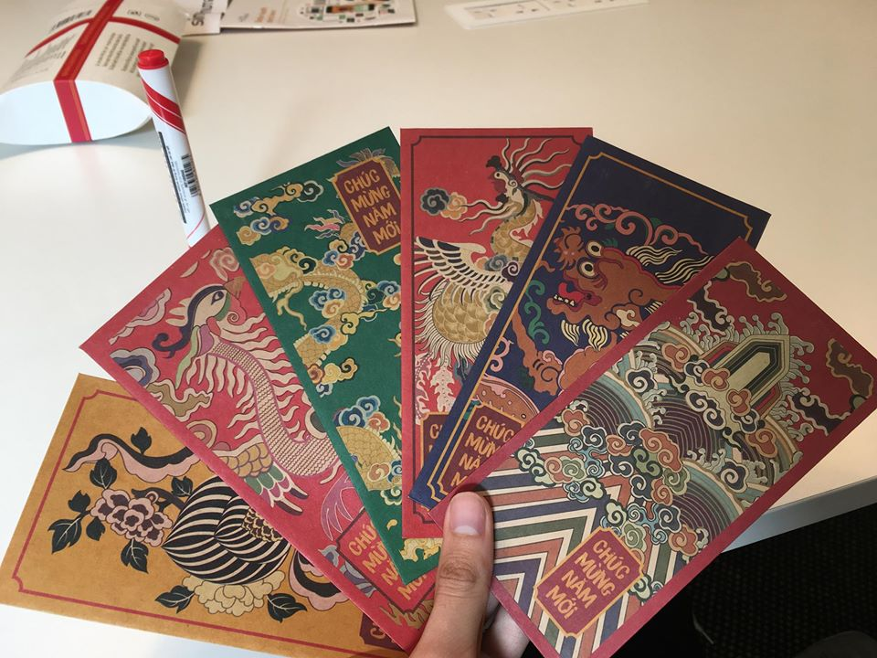

Một ví dụ của anh Việt Anh về việc sử dụng Thiết kế mang phong cách Việt Nam. Mỗi người bị "bắt" phải cầm một chiếc lì xì mang về.

Qua bài khảo sát, mình còn được biết thêm nhiều thông tin thú vị về màu sắc khi anh Việt Anh nhắc đến màu vàng nhạt của những công trình thời Pháp thuộc, những cơ quan nhà nước. Một chị gái lý giải cho việc này là bởi vì ngày xưa mọi người thường quét nước vôi chứ không có sơn như bây giờ, sự biến đổi màu của nước vôi đã khiến cho những công trình, mái nhà đều có màu vàng giống nhau, dần dần nó trở thành một thói quen về việc lựa chọn màu sơn để quét lên tường nhà. Hay là một ví dụ về màu của gốm sứ Việt Nam, luyện gốm ra màu gì thì còn phụ thuộc vào đất đai từng khu vực, hôm đó mình bị lỡ mất thông tin này, may mà có [Khánh Hưng](https://www.facebook.com/dokhanhhung95?eid=ARAjrZiZ8pZ2F71W5HqJZ_Bx8rtMuGwinEjuVfRo97PCU0HSJ9uQdHyWKEfC_7bEg_uuImKFVN8QSeMg) nhắc, giờ mình mới biết nhiều người phương tây gọi đồ gốm sứ là China.

Đó là câu chuyện về màu sắc, dường như chỉ sử dụng màu sắc thì chưa đủ mạnh để nói cho du khách nước ngoài biết rằng một thiết kế mang phong cách Việt Nam. Một thiết kế tốt phải là một thiết kế biết kể chuyện, và nếu xâu chuỗi với những chia sẻ của anh Việt Anh về sự kết hợp với tuổi thơ, lịch sử và văn hóa thì chắc chắn thiết kế đó sẽ toát lên được vẻ đẹp nội địa, hay cụ thể hơn là vẻ đẹp Việt Nam.

# Trải nghiệm mô hình Thiết kế nước rút

Lại một lần nữa, mình được trải nghiệm mô hình thiết kế này, nhưng lần gần đây nhất thì mình chỉ được làm 2/4 quy trình vì không có đủ thời gian cũng như chuẩn bị trước. Mô hình thiết kế nước rút được phân bổ ra làm 5 ngày trong tuần, mỗi ngày là một quá trình làm việc khác nhau để bổ sung cho nhau. Nhưng ở buổi hôm vừa rồi thì mình đã được trải nghiệm cả 5 bước chỉ trong một buổi chiều. Đề bài là tìm cách nào đó để giúp những lọ mứt Tết mà anh Việt Anh mang đến có được thiết kế tốt hơn, mang đậm phong cách Việt Nam hơn.

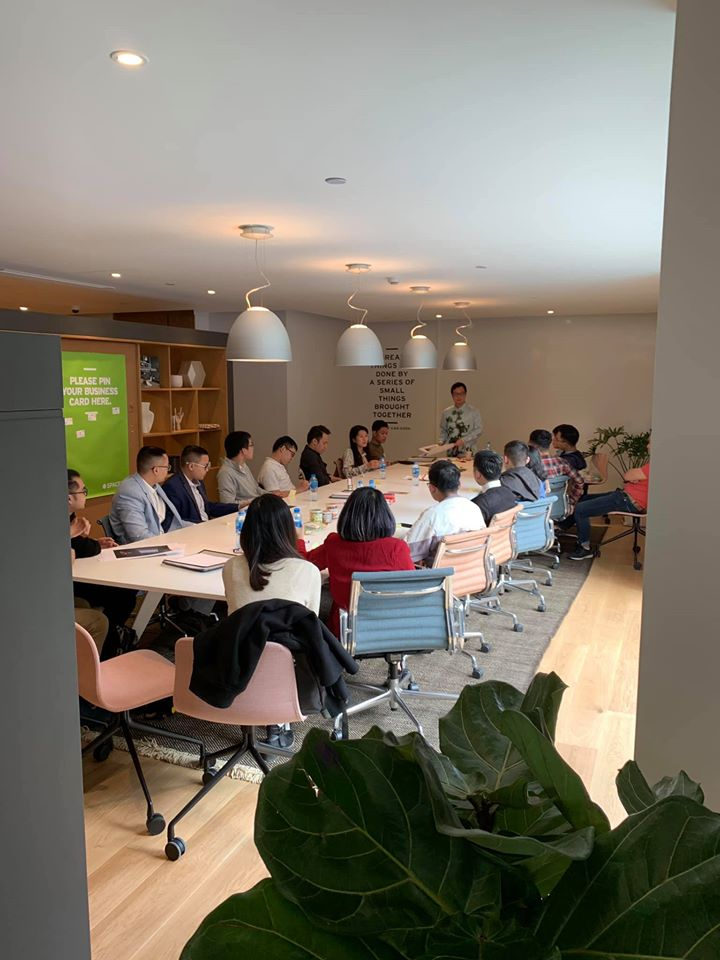

Có một thứ mình học được từ mô hình thiết kế này là cách đặt câu hỏi sao cho đúng, đây là một trong những công việc mà một đội ngũ Thiết kế sẽ phải ngồi với nhau trong ngày đầu tiên của tuần, mẫu câu hỏi là "Làm sao để...", đa số các công ty khởi nghiệp thất bại là vì họ chưa đặt được một câu hỏi đúng. Có 5 yếu tố mà anh Việt Anh chia sẻ để giúp mọi người tự tìm ra vấn đề và đặt câu hỏi đúng:

- **Đẩy cái tốt:** Đưa những thứ mà mình cho là đã tốt lên một tầm cao mới.
- **Giảm cái xấu:** Tìm cách hạn chế những thứ không hoặc ít mang lại lợi ích cho người dùng.
- **Thử cách đối nghịch:** Trong cái rủi luôn có cái may! Cái may ở đây là gì? Làm sao để thử được cái may đấy và biến nó thành một thứ mang lại giá trị cho mình?
- **Kiểm tra lại thừa nhận:** Xem xét lại sự đánh giá của mình về một vấn đề gì đó
- **Phát hiện tiềm năng:** Giúp phát triển những thứ không hoặc ít có giá trị thành một thứ mang lại giá trị cho người dùng.

Sau khi đặt được câu hỏi cho vấn đề của mình, tất cả những người tham dự được chia thành 5 đội, mỗi đội phải lựa chọn 1 trong năm yếu tố bên trên để tự đặt ra câu hỏi và sử dụng phương pháp "**số 8 điên cuồng**" diễn giải ý tưởng của mình. Đây chính là một phần công việc mà đội ngũ thiết kế sẽ phải làm ở ngày thứ 2 của tuần.

Mỗi người được phát một tờ giấy A4 và gấp thành 8 ô khác nhau. Sau 8 phút, tất cả mọi người bắt buộc phải hoàn thành việc diễn giải ý tưởng vào 8 ô giấy. Người thì mệt mỏi, người thì ruột gan lẫn lộn, người thì vui, người thì phấn khích, nhưng có một điểm chung là ai nấy đều có những ý tưởng của riêng mình.

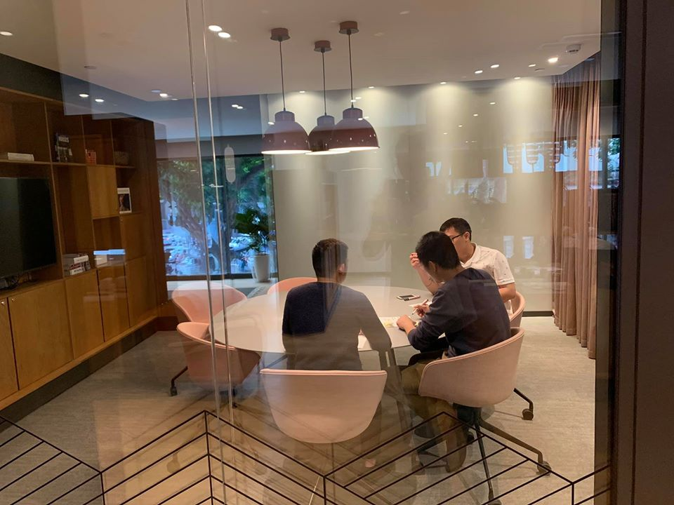

Chia nhóm, thiết kế ý tưởng.

Giả định ngày thứ 2 kết thúc, tất cả mọi người sẽ có một ngày để thảo luận chung với nhau để chọn lấy một ý tưởng tốt nhất để đem nó sang ngày thứ 4. Mọi người cùng nhau dựng lên những bản mẫu theo ý tưởng đã thống nhất sử dụng tất cả những gì có trên bàn: bút, giấy, kéo, keo dán,... Cảm nhận của mình là cực kì phấn khích, bọn mình cố gắng cắt thật nhiều giấy và vẽ những mẫu tem mác mới cho lọ mứt, sau đó dán vòng quanh lọ mứt để trưng bày. Phương pháp điên rồ này đã đem đến những ý tưởng thực sự điên rồ!

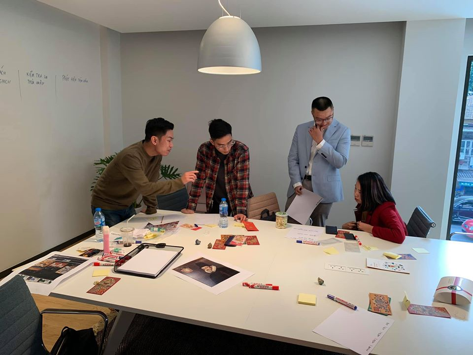

Sử dụng mọi thứ trên bàn để thiết kế nhãn mác cho lọ mứt Tết.

Sau đó mọi người tiếp tục được yêu cầu chuyển đến ngày cuối cùng trong mô hình Thiết kế nước rút, đó là bước kiểm tra, đánh giá thiết kế của mình với người dùng. Khán phòng hôm đó như một cửa hàng bán mứt hoa quả và mọi người trong vai khách mua sắm. Từng nhóm sẽ phải giới thiệu về thiết kế của mình cho khách hàng, có nhiều nhóm táo bạo đến nỗi không ngờ như việc thiết kế hộp đựng mứt dừa như một hộp đựng giấy ăn để người dùng có thể kéo ra liên tục, hay là việc thiết kế một hộp đựng mứt nhưng lại dùng sản phẩm bao bì như một hộp đựng thịt trâu gác bếp để bán cho các nhà hàng, giúp khách hàng của họ làm bài kiểm tra độ say cồn, tăng sự thú vị trong bữa ăn.

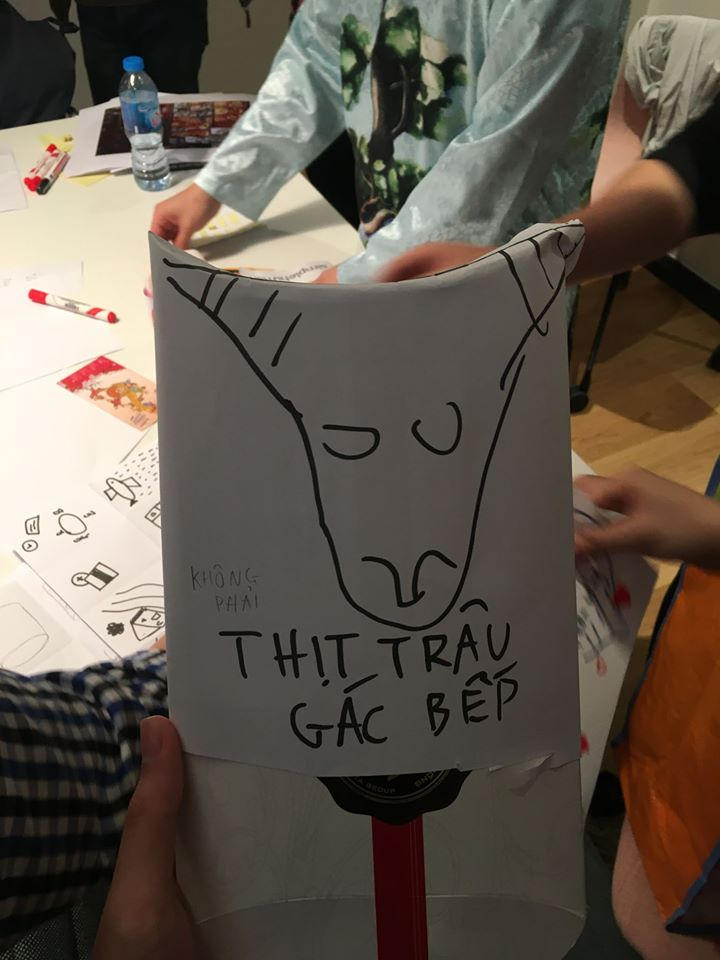

Kết thúc buổi trình bày về thiết kế cũng là kết thúc về buổi gặp mặt đầy thú vị ấy, ai nấy cũng đều thích thú. Cả đội rủ nhau đi uống ly trà, ăn thử chút Xôi Yến nổi tiếng Hà Nội và chia tay nhau để về quê đón Tết bên gia đình. Một lần nữa cám ơn anh Việt Anh rất nhiều vì buổi chia sẻ đầy cảm hứng này, hi vọng còn được gặp anh nhiều hơn nữa, và hi vọng ngày nào đó Việt Nam sẽ trở thành một cường quốc về thiết kế.