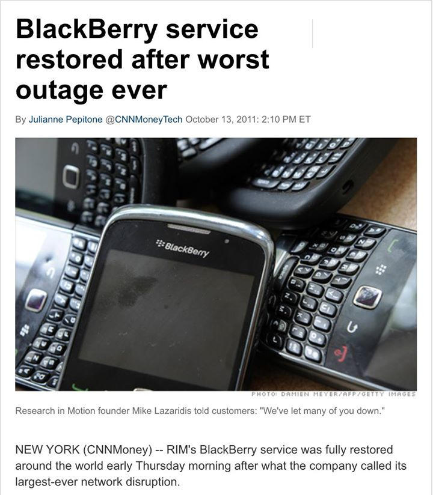
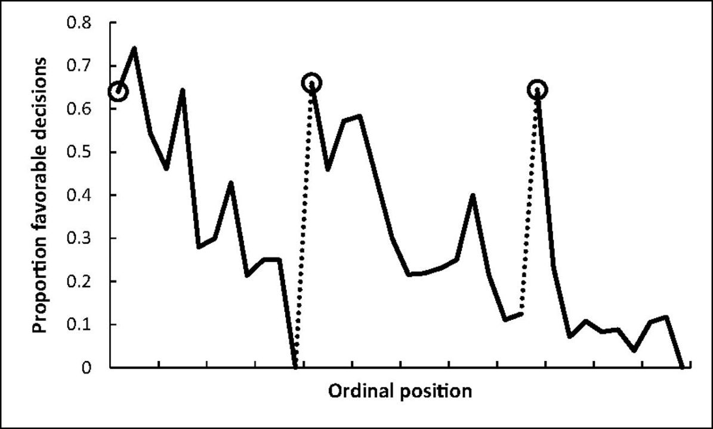
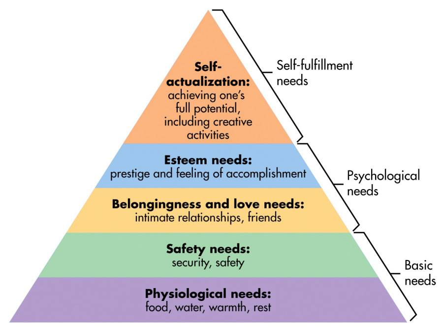
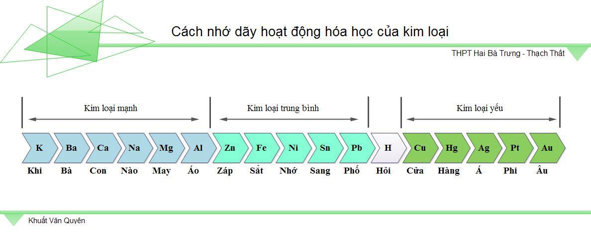
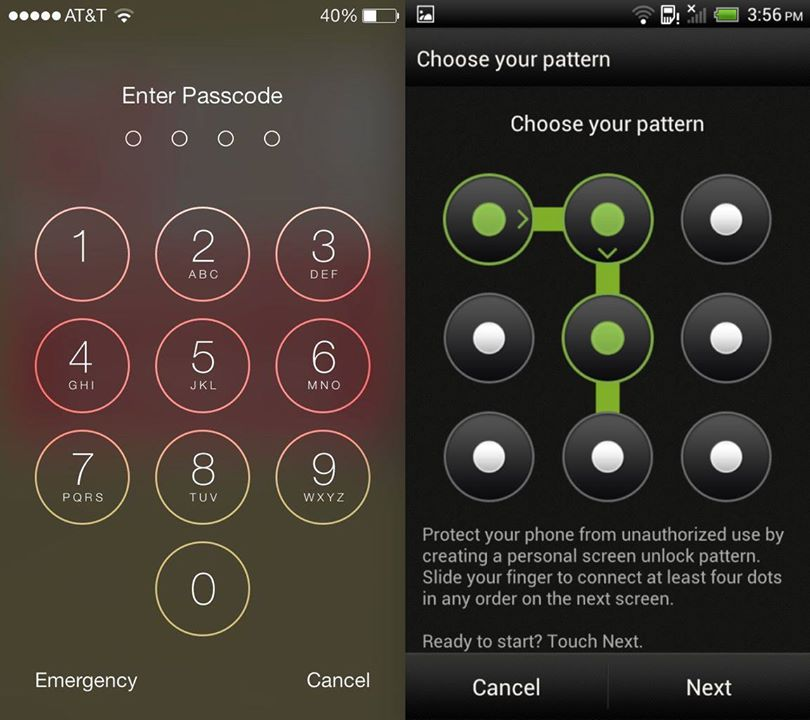
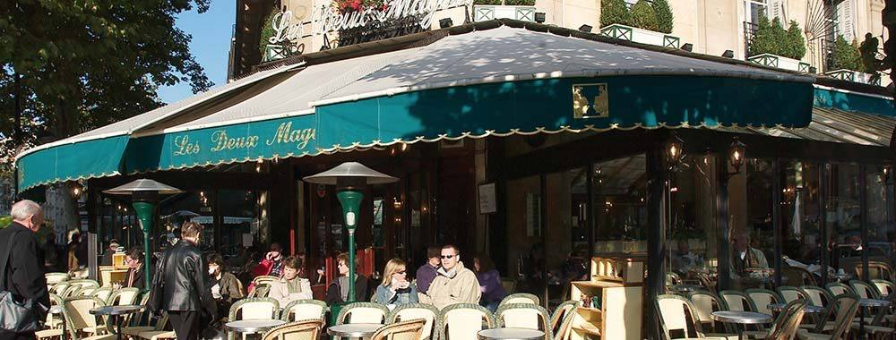

Nghe thì có vẻ đầy học thuật, chuyên sâu, nhưng thực chất thì bài viết này sẽ giúp mọi người có một cái nhìn toàn diện hơn về việc đánh giá mọi thứ xung quanh, cách chúng được tạo ra, hoạt động như thế nào, làm sao để có thể thiết kế sản phẩm giúp người dùng cảm thấy thực sự vui vẻ khi sử dụng chúng.

Mình cũng cố gắng đưa ra thật nhiều ví dụ thực tế để mọi người dễ dàng tiếp cận vấn đề hơn và biết cách ứng dụng những gì học được vào những dự án thực tế mà các bạn đang thực hiện.

Bài viết này là một sự tổng hợp lại những gì mình đã học được từ [buổi thuyết trình](https://l.facebook.com/l.php?u=https%3A%2F%2Fwww.youtube.com%2Fwatch%3Fv%3DVKRHzoz8aSQ%26fbclid%3DIwAR39fnlLS7m8pHVERmkO_lmSLjCAyVwawJCH2aX540NoL0oXO9p-QI7RbNg&h=AT2KfCD5QxAVI_lkCZLbKo_kWlBDiCVGQS1uXgEzG8Bj23HEkIhfWkXmwCxlTZ_E7y1eH-ZJnsQK9ym-Km-3JX-ydTOWYOQu_77D6jJ02I3Hk6Ipbh8jHmaNgTveN8SPoUkxw9bqOI8) của Joe Leech tại SmashingConf SF 2018 về chủ đề ứng dụng tâm lý học vào thiết kế trải nghiệm người dùng. Joe Leech đã có tới 14 năm kinh nghiệm trong việc này, ông từng góp phần vào việc phát triển những trang web như mariott.com, ebay.com. Nhìn chung thì công việc của ông là giúp các công ty phát triển theo đúng hướng, đạt được những kết quả kinh doanh thuận lợi, giúp họ tìm ra những lý do đúng đắn để tiếp tục phát triển, cùng với đó là khiến người dùng hài lòng khi sử dụng các sản phẩm. Đồng thời ông còn là tác giả của cuốn sách Psychology for Designers, nội dung nói về việc ứng dụng tâm lý học trong việc thiết kế trải nghiệm người dùng.

Nội dung của bài viết được chia thành 3 thành phần chính, đầu tiên mình sẽ chia sẻ về những thực hành để giúp mọi người hiểu về tâm lý học, cách người dùng sử dụng các sản phẩm hàng ngày một cách tóm tắt, sau đó là một số ví dụ thực tế trong việc thiết kế cải thiện trải nghiệm người dùng.

# **Nắm rõ người dùng của mình**

### Sự sao nhãng

Trước tiên thì mình có một vài chia sẻ khá vui, theo như số liệu thống kê vào tháng 10 năm 2011 ở Dubai và Abu Dhabi, tỉ lệ các vụ tai nạn xe hơi nghiêm trọng đã giảm xuống một cách đáng kể, cụ thể là 20% ở Dubai và 40% ở Abu Dhabi, lý do giải thích cho việc này không phải vì mọi người có ý thức tham gia giao thông tốt hơn hay gì cả, mà là bởi vì hệ thống nhắn tin của BlackBerry đã bị sập và mất 48 tiếng đồng hồ để hoạt động trở lại. Điều này lý giải rằng con người thường không giỏi trong việc làm cả 2 thứ cùng một lúc, cụ thể là sử dụng điện thoại khi tham gia giao thông. Mặt khác, mọi người đang quá tự tin vào việc có thể làm tốt được cả 2 thứ trong cùng một thời điểm.

Dịch vụ của BlackBerry sống lại sau khi bị sập

Một ví dụ khác là việc theo dõi chương trình American’s Got Talent ở Mỹ, có tới 40% người trong tổng số những ai sử dụng thiết bị công nghệ bao gồm điện thoại, máy tính bảng, laptop vừa xem TV, vừa... sử dụng chúng.

Chương trình Tìm kiếm tài năng nổi tiếng

Những ví dụ trên chỉ ra rằng các sản phẩm đó chưa được thiết kế ra một cách “hoàn hảo” nhất, người dùng dành 100% sự tập trung vào nó, họ thường bị sao nhãng, mất tập trung vào sản phẩm và tạo những ảnh hưởng không tốt.

### Sự mệt mỏi

Biểu đồ thể hiện sự liên quan giữa tỉ lệ đưa ra quyết định tốt và thời điểm trong ngày

Biểu đồ trên thể hiện sự liên quan giữa tỉ lệ những quyết định đúng đắn được đưa ra so tương ứng với thời gian trong ngày. Nó chỉ ra rằng, những quyết định không tốt thường được đưa ra vào thời điểm trước bữa sáng và bữa trưa. Con người dễ đưa ra những quyết định sai lầm khi đang trong tình trạng đói mệt. Thực tế khi người dùng phải sử dụng một trang web trong lúc bụng đang sôi cồn cào vì chưa được nạp đầy thức ăn, họ sẽ có xu hướng dễ cáu giận, bực tức hơn bình thường đấy nhé.

### Động lực

Ngoài ra, sự mệt mỏi còn khiến con người trở nên “lười biếng” hơn, bạn không thể nào tập trung vào công việc nếu cả ngày mệt mỏi, nhức đầu phải không? Động lực làm việc của bạn sẽ bị giảm đi một cách đáng kể và khiến bạn không thể đạt được hiệu suất làm việc cao khi đang rất mệt mỏi.

Tháp nhu cầu của Maslow

Đây là một hình ảnh về Tháp nhu cầu của Maslow, bạn có thể thấy rằng thức ăn, nước uống, nghỉ ngơi là nhu cầu cơ bản của con người, đó cũng chính là lý do tại sao bạn luôn cần có một cái bụng no, sức khỏe tốt để có thể làm mọi việc một cách suôn sẻ. Nhưng thực tế thì tháp nhu cầu này cũng không hoàn toàn đúng với mọi trường hợp, với những tầng tháp cao hơn, nhu cầu của con người có thể xáo trộn cho nhau ở một số chỗ, tùy thuộc vào con người ở mỗi nền văn hóa khác nhau.

### Lựa chọn

Tất cả mọi người đều thích được quyền lựa chọn, đó là điểu hiển nhiên rồi còn gì, nhiều sự lựa chọn giúp họ cân đo đong đếm và quyết định lấy một thứ mà mình cảm thấy thích hoặc phù hợp nhất, và đôi khi những sự lựa chọn này khiến họ bối rối và không biết phải làm gì. Một ví dụ về việc thiết kế logo cho khách hàng, khi bạn hỏi khách hàng muốn xem 5 hay là 10 tùy chọn, thì đương nhiên là họ sẽ chọn con số 10, nhưng thực tế cho thấy rằng trường hợp bạn đưa cho khách hàng 5 lựa chọn sẽ giúp bạn nhanh có hợp đồng hoặc thu được chi phí từ khách hàng hơn là 10 lựa chọn, những gì mọi người nói với bạn thường trái ngược lại so với những gì họ sẽ làm. Do đó bạn cần phải theo dõi cách người dùng của mình làm những gì hơn là chỉ đưa cho họ những câu hỏi và bắt họ lựa chọn.

Lựa chọn như thế nào? — ảnh Google

Một ví dụ về việc đưa cho người dùng những sự lựa chọn, con người thường thích làm những công việc nhanh và tốn ít công sức và họ sẽ đưa ra những lựa chọn đúng đắn chỉ khi có ít tùy chọn. Việc phải đưa ra quyết định trước một đống tùy chọn đồng nghĩa với việc họ tốn nhiều công sức hơn để suy nghĩ. Nếu bạn khiến người dùng phải suy nghĩ, bạn sẽ khiến họ cảm thấy mệt mỏi, và ở phần trước mình đã nói về việc sự mệt mỏi ảnh hưởng như thế nào đến quyết định tiếp tục ở lại để sử dụng sản phẩm của bạn rồi.

# **Tâm lý học và sự tương tác**

Bộ não của con người hoạt động khá phức tạp, thông thường thì bạn sẽ không nhớ một thứ gì đó chính xác mà sẽ thông qua việc liên kết một phần thông tin nhớ được với những thứ khác. Ví dụ như ngày xưa học Hóa học, việc học thuộc thứ tự trong dãy hoạt động hóa học của kim loại là cực kì khó vì bạn phải nhớ tên của các nguyên tố hóa học bằng những kí tự chữ cái không có nghĩa, nhưng với việc gán chúng vào các từ và ghép thành một câu văn có nghĩa sẽ giúp bạn nhớ dãy hoạt động hóa học này dễ dàng hơn và cũng khó quên hơn.

Dãy hoạt động hóa học của kim loại — ảnh Khuất Văn Quyên

Ngoài ra thì việc ghi nhớ cũng có thể thực hiện bằng cách kết nối các sự vật có liên quan tới nhau, ví dụ điển hình là lúc cần ghi nhớ các mốc thời gian khi học Lịch sử, các dấu mốc thời gian có liên hệ trực tiếp đến những hoạt động tại thời điểm đó và chỉ cần nhắc đến ngày nào, tháng nào, năm nào là đã có thể gợi nhớ đến nhiều thông tin khác rồi.

Tuy nhiên việc ghi nhớ như vậy vẫn có thể được tôi luyện và trau dồi dần dần, ví dụ như khi làm lập trình viên, bạn sẽ phải nhớ chính xác từng câu lệnh, nhưng bạn vẫn có thể làm việc này đơn giản mà không cần phải áp dụng các phương pháp trên bởi vì bạn đã được đào tạo để làm việc này.

Khi áp dụng việc ghi nhớ vào thiết kế trải nghiệm người dùng, bạn cần để ý đến 2 loại tri thức là tri thức có sẵn và tri thức tự tạo ra. Để dễ hiểu, hãy lấy một ví dụ là màn hình mở khóa của 2 nền tảng điện thoại iOS và Android, trên các thiết bị iOS, mọi người thường sử dụng mật khẩu dạng mã kí tự, còn trên các thiết bị Android thì mọi người thường sử dụng mật khẩu dạng nối nối. Theo mình thấy thì phương pháp trên các thiết bị Android sẽ tốt hơn vì mật khẩu đó do chính người dùng tạo ra, các bước nối giữa các điểm trên màn hình có sự liên quan với nhau và nó dễ nhớ hơn so với việc phải nhớ lại từng kí tự chữ cái, con số như phương pháp của iOS. Do đó khi sử dụng mật khẩu dạng mã kí tự, người dùng thường sử dụng các mật khẩu rất dễ nhớ như 123456, QWERTY,… các kí tự nối tiếp nhau theo trình tự logic nhất định và nó giúp họ dễ nhớ hơn.

Màn hình mở khóa của iOS và Android — ảnh Google

Tri thức tự tạo ra được định hình từ việc con người trở nên quen thuộc với những thứ gì đó dần theo thời gian, ví dụ khi truy cập vào một trang web bán hàng, bạn sẽ biết rằng click vào logo của trang web để quay trở lại trang chủ, hộp công cụ tìm kiếm nằm ở góc trên bên phải, hay giỏ hàng luôn được đặt ở góc trên cùng bên phải. Nếu ai đó thiết kế một trang web mà thay đổi những vị trí đó, thì họ đang đi ngược lại luồng thao tác và thói quen cơ bản của người dùng và điều đó là không nên. Nên nhớ rằng, khi thiết kế sản phẩm thì đừng bao giờ đi ngược lại so với những trải nghiệm tương tác cơ bản.

Những ví dụ về vị trí hiển thị của logo, hộp công cụ tìm kiếm gọi chung là design axiom, nghĩa là cách tốt nhất để thiết kế một cái gì đó. Nếu bạn không biết chắc việc sắp xếp, thiết kế bạn sắp làm là design axiom thì không nên tiếp tục, vì rất có thể người dùng sẽ quay lưng với bạn hoặc ít nhất là cảm thấy khó chịu khi sử dụng sản phẩm của bạn. Một ví dụ điển hình là Wikipedia đã bỏ đi nút Tìm kiếm trong hộp công cụ tìm kiếm vì nghĩ rằng có thể thay thế nó bằng việc ấn nút Enter, và đã có tới 97% người dùng phản ánh về sự thay đổi này, nó khiến họ cảm thấy khó chịu và muốn đội ngũ Wikipedia đưa nút Tìm kiếm trở lại ngay lập tức. Bài học rút ra ở đây là, khi thiết kế thì cần phải lường trước việc nó có khiến người dùng ghét bỏ, khó chịu hay không.

# **Tâm lý học và trải nghiệm người dùng**

Có 2 ví dụ nổi tiếng về việc thiết kế mô hình kinh doanh dựa trên trải nghiệm của người dùng là những quán cà phê truyền thống ở Paris và những quán cà phê Starbucks. Ở những quán cà phê truyền thống, bạn chỉ việc đến đó tìm chỗ ngồi và chờ bồi bàn đến tận nơi order đồ uống, nhưng ở những quán Starbucks, bạn sẽ phải xếp hàng để order đồ uống và thanh toán cho đồ uống ngay lúc đó.

Một quán cafe nổi tiếng tại Paris — ảnh Google

Ở Paris, nếu bạn đến một quán cà phê truyền thống và bồi bàn biết rằng bạn không biết nói tiếng Pháp, khi order đồ uống thì họ sẽ yêu cầu bạn thanh toán ngay tại chỗ, còn nếu bạn nói tiếng Pháp thì họ sẽ chờ khi nào bạn đứng dậy mới tới thu tiền, cá nhân mình rất thích cách cá nhân hóa trải nghiệm ở đây. Còn ở Starbucks, thử tưởng tượng nếu bạn là người Pháp hoặc chưa biết đến mô hình kiểu này bao giờ, cá là bạn sẽ cảm thấy rất quê khi ngồi mãi mà chả thấy ai ra order đồ uống.

Hình ảnh xếp hạng đặt đồ tại Starbucks — ảnh Google

Ở Việt Nam, có hôm mình đi tìm quán cà phê để ngồi làm việc tình cờ phát hiện ra một thứ rất hay ho. Mặc dù cuối tuần thì ở đâu cũng đông người, nhưng có một cơ sở của Highlands rất đặc biệt và làm mình ghim rât lâu vì ở đây có rất nhiều trẻ con, bàn ghế thì được bố trí rất đơn giản và toàn là cỡ nhỏ. Khác hẳn với những quán Highlands hay những quán cà phê hiện đại ở các khu vực công sở mà mình từng ngồi, bàn ghế ở những nơi đó rộng, thoải mái hơn, có khi họ còn đầu tư cả sofa. Còn với quán này, nó cùng khu với một siêu thị và là nơi các gia đình ở ngoại thành hay đến siêu thị mua đồ với cả cho trẻ em đến vui chơi. Có lẽ vì thế mà họ dùng toàn bàn ghế cỡ nhỏ, dành cho ít người, đồ đạc trang trí cũng không cầu kì để hạn chế các đoàn gia đình đông người dẫn nhau vào cũng như là tránh bọn trẻ đùa nghịch gây ồn ào, ảnh hưởng tới người khác. Không biết có đúng với suy nghĩa của chủ cơ sở hay không nhưng việc quan tâm đến tâm lý, thói quen và văn hóa của người dùng, thế giới xung quanh khi thiết kế nói chung và thiết kế quán cà phê nói riêng là rất cần thiết.

Khi xây dựng và thiết kế sản phẩm, bạn cần phải có hiểu biết về thế giới xung quanh và biết cách ứng dụng vào các tình huống khác nhau, có thể những sự thay đổi sẽ khiến người dùng cảm thấy bối rối và bạn sẽ cần phải cân nhắc về việc triển khai những sự thay đổi đó. Nếu bạn hiểu cách người dùng nghĩ và sử dụng sản phẩm như thế nào và đồng thời có hiểu biết về thế giới xung quanh thì sẽ có thể thiết kế những sản phẩm một cách “tâm lý” hơn, giúp người dùng cảm thấy hạnh phúc, thoải mái khi trải nghiệm những sản phẩm đó.

Khi ứng dụng vào thiết kế, bạn cần phải tìm cách thiết kế sản phẩm của mình phù hợp với tâm lý của người dùng. Cụ thể là hiểu được người dùng của mình muốn gì và tìm cách giúp họ đạt được mục đích đó sao cho vẫn đạt được mục tiêu kinh doanh của công ty.