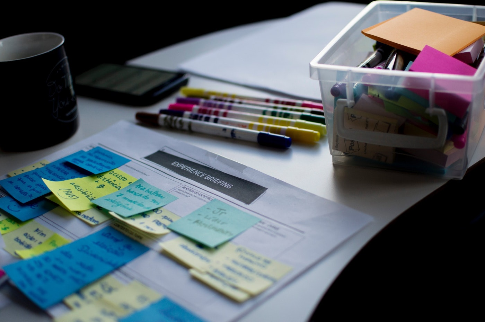
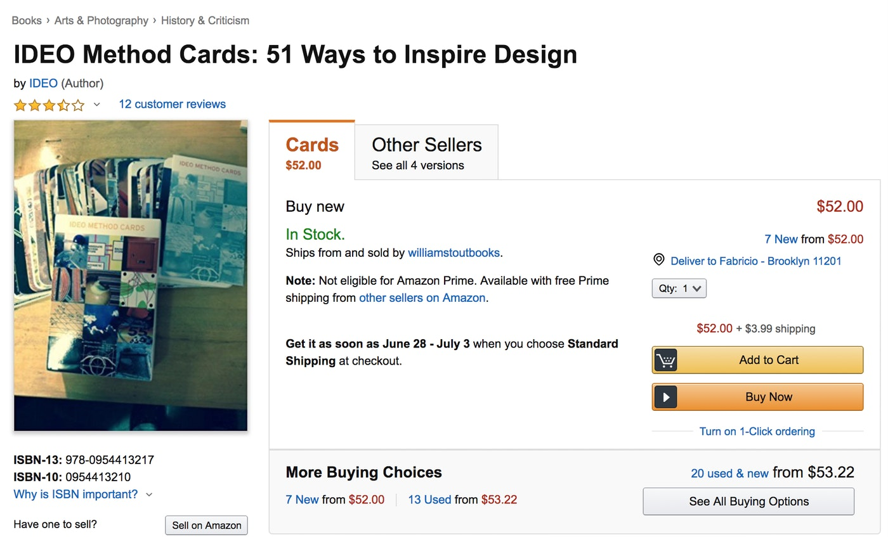

Phương pháp thiết kế hiểu đơn giản là một tập các bước thiết kế mà bạn có thể tham khảo để sử dụng, cho nên bạn hoàn toàn có thể áp dụng để giải quyết những vấn đề về thiết kế tương tự như nhau mà không cần phải phát minh ra bất cứ thứ gì mới mẻ cả.

Từ một phương pháp thiết kế, ta có thể dựa vào đó để làm những công việc cụ thể, nó giúp chúng ta truyền đạt ngôn ngữ thiết kế cho mọi người trong nhóm hoặc trong công ty dễ dàng hơn. Ngoài ra, nó còn giúp chúng ta tạo ra những thiết kế dễ tiếp cận tới nhiều người hơn, đồng nghĩa với việc các ngành công nghiệp khác cũng sẽ bắt đầu việc tìm hiểu giá trị mà thiết kế mang lại.

Quan trọng hơn, nó còn làm cho công việc của chúng ta chuẩn chỉ hơn, gọn gàng hơn, và mang tính thống nhất hơn, tạo cảm giác ngầu hơn khi hầu như mọi người chỉ coi thiết kế là một cái gì đó nghệ nghệ.

Trong vòng 20 năm trở lại đây,  các công ty như IDEO, frog, IBM, Cooper đã làm rất tốt trong việc chuẩn hóa và phổ biến những phương pháp thiết kế.

Method cards, bộ bài do IDEO phát triển tổng hợp những phương pháp phổ biến, giúp mọi người tìm cảm hứng, đặt họ vào trung tâm của một quy trình thiết kế, và tránh gặp phải khó khăn khi phải tìm cách giải quyết một vấn đề gì đó. Nó còn giúp cho những người không-phải-người-làm-thiết-kế hiểu được việc thiết kế một cách có phương pháp, có khoa học là như thế nào, đặc biệt là nó còn ảnh hưởng đến việc quyết định của những người làm kinh doanh khi họ muốn đưa ra quyết định về việc đầu đư vào thiết kế.

Mặt khác, nhiều công ty đã công nhận phương pháp thiết kế là một cách để tăng thêm giá trị dịch vụ của họ, định vị họ trở thành những người dẫn đầu trong một vài lĩnh vực cụ thể.

Điều khiến chúng ta cần phải cân nhắc là nhiều người làm thiết kế đã đi quá xa, bắt đầu bị ám ảnh về các phương pháp thiết kế, đó là khi họ sử dụng các phương pháp thiết kế cho mọi lúc, và nghĩ rằng không có cách nào khác để giải quyết một vấn đề về thiết kế ngoài những phương pháp được tổng hợp trong bộ method cards.

Dưới đây là một vài lời khuyên để bạn không bị đi quá xa như vậy:

### Đừng ra vẻ là bạn biết mọi phương pháp thiết kế

Nói thẳng ra thì là đừng kiêu ngạo về sự hiểu biết của mình. Bạn nghĩ là mình thông minh, giỏi giang vì bạn biết mọi phương pháp thiết kế như thế nó như thế nào ư? Điều quan trọng nhất mà bạn không có chính là yếu tố cơ bản nhưng rất thiết yếu để trở thành một người làm thiết kế chính là tự đặt bản thân của mình vào vị trí của người khác, biết cách đồng cảm, biết tiếp cận mọi người trong việc mà bạn đang làm.

### Đừng nghĩ rằng một phương pháp thì có thể sử dụng được ở mọi ngữ cảnh

Sử dụng một phương pháp nào đó một lần và thấy nó hoạt động đúng như mong đợi thì không có nghĩa là nó sẽ luôn luôn hoạt động tốt. Mỗi một yêu cầu về thiết kế đều có những sự khác biệt, hiệu quả của một phương pháp thiết kế phụ thuộc vào nhiều khía cạnh mà chính bạn cũng không thể kiểm soát được hết: yêu cầu thiết kế, tổ chức nhóm, ngành nghề, đối tượng hướng đến, công cụ,... còn nhiều nữa và mình cũng không thể liệt kê được hết. Hãy chắc chắn là bạn thấy trước được càng nhiều những khía cạnh trên càng tốt trước khi chọn cho mình một phương pháp đúng đắn. Và đừng quên là các phương pháp chỉ là một cơ sở để bạn dựa vào, với tư cách là một người làm thiết kế thì bạn không nên dựa dẫm hoàn toàn vào nó, bạn cần phải biết cách áp dụng nó như thế nào cho hợp lý để đạt được những lợi ích nhất định.

### Đừng nghĩ rằng cứ áp dụng các phương pháp đó thì sẽ là designer

Nó giống như kiểu ai cầm micro lên hát thì sẽ là ca sĩ vậy, quan trọng là kinh nghiệm. Để trở thành một người làm thiết kế phải trải qua một quá trình khá gian khổ, đòi hỏi nhiều thử nghiệm, thành công và thất bại, chứ chưa nói đến việc trở thành một người làm thiết kế giỏi.

### Đừng trở nên phụ thuộc vào các phương pháp thiết kế

Mặc dù method cards là cách dễ dàng nhất để tiếp cận các phương pháp thiết kế song việc luôn có hướng dẫn bên cạnh và phụ thuộc vào nó có thể khiến bạn trở thành một con nghiện. Nhiều người đã bị ám ảnh về việc phải làm theo các bước cụ thể được phác thảo trong method cards, hoặc là sử dụng một mẫu persona có sẵn trên mạng, họ quên mất lý do tại sao lại sử dụng phương pháp đó. Việc dành sự tập trung cho cái sự đẹp đẽ, bóng bẩy khi sử dụng những template có sẵn đó (output) thay vì hiệu quả của công việc (outcome) có thể trở nên cực kỳ nguy hiểm đối với người làm thiết kế, nó sẽ tạo thành một tư duy xấu và khiến cho cả thế hệ bị phụ thuộc vào việc nghe theo người khác nói, làm theo người khác làm.