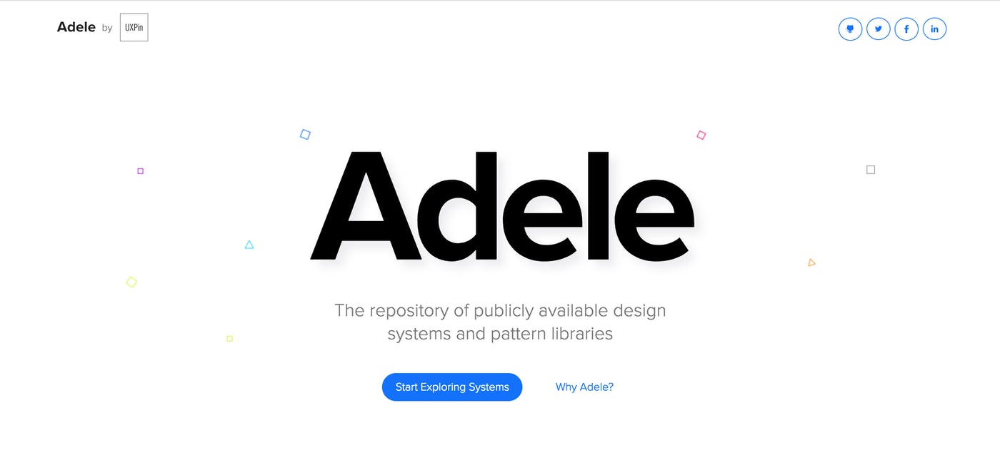
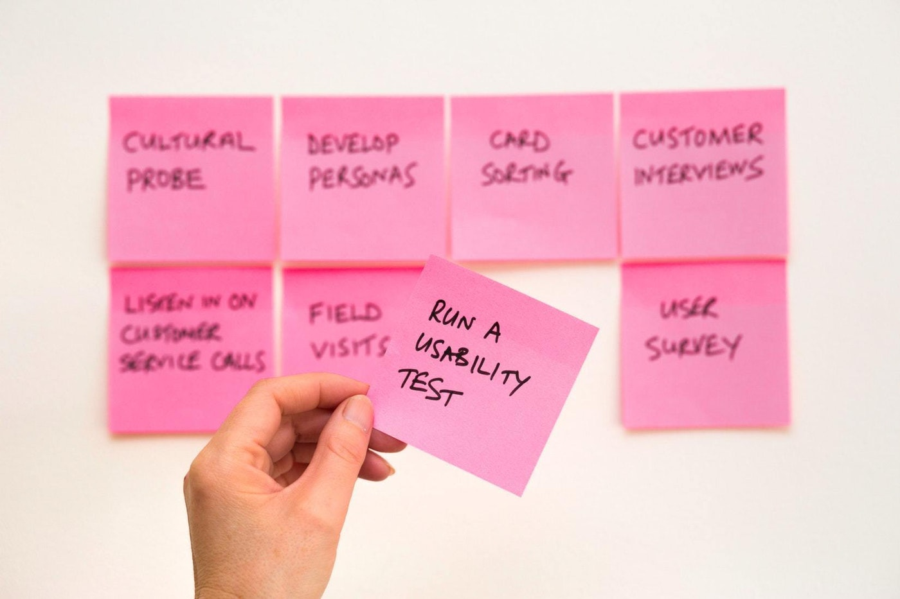

# Mở đầu

Vài tuần trước, mình nhận được một câu hỏi từ ông anh học cùng lớp thiết kế về việc bảo vệ ý tưởng khi tranh luận với sếp, theo như mình hiểu thì những cuộc tranh luận đó đều kết thúc bằng việc sếp của ông ấy khẳng định "như thế này mới là chuẩn", ông ấy cũng không biết làm thế nào để bảo vệ ý tưởng của mình hay phản bác lại ý kiến của sếp.

Bản thân mình thấy đây cũng là một vấn đề khá phổ biến với những anh em mới làm thiết kế như mình do kinh nghiệm còn ít và tiếng nói trong công ty còn hạn chế, nhiều khi không biết làm thế nào để tìm được dẫn chứng, lý lẽ để bảo vệ ý kiến cá nhân. Mình xin chia sẻ một chút kiến thức đã tích lũy được trong quá trình nghiên cứu, giúp các bạn bảo vệ ý tưởng thiết kế khi trao đổi với sếp, khách hàng hay các bên liên quan.

Dựa vào mỗi dự án mà nhu cầu của các bên liên quan sẽ khác nhau, nhưng có một số vấn đề mà hầu như dự án nào cũng gặp phải. Mình đã liệt kê ra một số câu hỏi mẫu mà theo mình bất kỳ ý tưởng thiết kế nào cũng nên đối chiếu qua nếu muốn thuyết phục sự đồng ý của người khác.

# Lợi ích của doanh nghiệp

Một trong những cách tốt nhất để khiến ý tưởng của bạn trở nên thuyết phục chính là kết nối nó trực tiếp tới nhu cầu của doanh nghiệp. Hãy thử trả lời những câu hỏi dưới đây để tự nhìn nhận xem ý tưởng của bạn đã đủ sức thuyết phục hay chưa.

### Có giúp doanh nghiệp đạt được mục tiêu nào không?

Những thiết kế mà bạn đưa ra đều phải hướng đến mục đích chung là giúp doanh nghiệp đạt được mục tiêu của họ, thường là doanh thu. Nếu bạn đưa ra được lý do tại sao ý tưởng của bạn có thể giúp doanh nghiệp đạt được nhiều tiền hơn thì chẳng có lý do gì mà họ không đồng ý với những giải pháp mà bạn đưa ra cả.

Nhưng để chỉ ra những giải pháp đó ảnh hưởng thế nào đến mục tiêu của doanh nghiệp thì không hề đơn giản, đặc biệt là đối với những thiết kế tương tác nhỏ mà có thể chẳng ảnh hưởng nhiều đến cách người dùng sử dụng cả một sản phẩm. Bạn không nhất thiết phải chỉ ra cụ thể, mà cần phải có đủ sự tự tin và kinh nghiệm để khẳng định rằng ít nhất những ý tưởng hay giải pháp đó là một bước đi nhỏ trong những cách tiếp cận xa hơn.

Khi trao đổi với sếp hay mọi người trong nhóm, mình thường đưa ra lý do và ảnh hưởng của những thiết kế đối với mục tiêu của công ty kiểu như: "**[những thiết kế này]** sẽ ảnh hưởng đến **[mục tiêu của doanh nghiệp]** bởi vì **[một vài lý do nào đó]**. Bằng việc này, ý tưởng đưa ra sẽ có trọng lượng hơn.

Nhưng lý do mà bạn đưa ra chỉ là sự khẳng định dựa trên kinh nghiệm cá nhân và chưa chắc nó đã khiến mọi người nghe theo nhưng ít nhất thì cũng đã giúp bạn xây dựng tư duy đưa ra giải pháp một cách chủ động và có mục đích hơn.

### Có giúp tối ưu ca sử dụng nào của người dùng không?

Đây có lẽ là cách giải thích phổ biến nhất, bởi vì mọi thứ chúng ta làm là thiết kế xoay quanh những ca sử dụng, tính năng của sản phẩm. Đồng thời chỉ ra những ca sử dụng hay tính năng nào sẽ được tối ưu khi giải thích ý tưởng của bạn sẽ giúp những ý tưởng đó trở nên có ý nghĩa hơn.

Việc tập trung vào những tính năng nhỏ nhặt có thể sẽ khiến bạn quên đi mục đích sử dụng chính của cả ứng dụng. Khi đưa ra một ý tưởng nào đó về việc cải thiện các ca sử dụng hay tính năng, hãy đối chiếu lại với những tài liệu liên quan đến những ca sử dụng đó để đảm bảo rằng bạn "không đi chệch khỏi đường ray".

### Có ảnh hưởng đến cách mọi người nhận diện hình ảnh doanh nghiệp?

Có thể việc này không ảnh hưởng nhiều đến trải nghiệm chung của người dùng nhưng một số trường hợp trang web hay ứng dụng mà bạn đang thiết kế chưa có quy chuẩn về màu sắc, phông chữ. Hãy cân nhắc đến việc giúp đỡ khách hàng hay sếp của mình xây dựng bộ tài liệu quy chuẩn về phong cách thiết kế. Hãy giải thích cho họ biết việc thể hiện các thiết kế một cách thống nhất sẽ giúp thương hiệu của họ lan tỏa dễ dàng hơn và đồng thời giúp họ tìm cách kết nối các thiết kế đó với nhau.

# Thiết kế

Đưa ra những lý lẽ liên quan đến thiết kế hay tính thẩm mỹ cũng là một cách tiếp cận để bảo vệ ý tưởng thiết kế của bạn. Cũng giống như phần trước, giải pháp của bạn cần phải trả lời được một số câu hỏi sau để có thể thuyết mục người khác dễ dàng hơn.

### Ý tưởng này có sử dụng mẫu thiết kế phổ biến nào không?

Nếu đang làm về sản phẩm, chắc hẳn bạn đã nghe đến câu "Don't reinvent the wheel", có nghĩa là "Đừng cố phát minh lại cái bánh xe". Những tính năng cơ bản, phổ biến trên nhiều ứng dụng, trang web khác nhau đều có một design pattern và best practice chung, công việc của bạn là tìm cách ứng dụng chúng vào sản phẩm của mình sao cho hài hòa với những phần còn lại. Bời vì người dùng không chỉ dành thời gian để sử dụng mỗi sản phẩm của bạn, hàng tá trang web, ứng dụng phổ biến khác có những chức năng tương tự như của bạn và họ đã quen với những thiết kế đó rồi. Việc đi ngược lại với những mẫu thiết kế phổ biến không những chẳng đem về hiệu quả cao mà có thể còn khiến bạn mất đi lượng người dùng đáng kể. Hãy áp dụng việc này vào khi giải thích ý tưởng của bạn cho người khác để thuyết phục họ dễ dàng hơn.

### Có giúp tăng sự chú ý của người dùng để họ đưa ra hành động?

Mình có dịch một bài viết liên quan đến [tâm lý của người dùng](https://www.facebook.com/notes/hoang-vu/%E1%BB%A9ng-d%E1%BB%A5ng-t%C3%A2m-l%C3%BD-h%E1%BB%8Dc-v%C3%A0o-thi%E1%BA%BFt-k%E1%BA%BF-tr%E1%BA%A3i-nghi%E1%BB%87m-ng%C6%B0%E1%BB%9Di-d%C3%B9ng/1065428583625975/) khi sử dụng một trang web hay ứng dụng di động, điều mình muốn nói ở đây là sự quan trọng của việc quan tâm đến cách người dùng quan sát, quét thông tin trên giao diện thiết kế của bạn sau đó quyết định đưa ra hành động. Do vậy, để dễ dàng thuyết phục được mọi người tin vào sự thành công của giải pháp mà bạn mang lại thì hãy giúp họ hiểu được lý do bạn thiết kế chúng, liên quan đến việc tăng sự chú ý của người dùng và quyết định đưa ra hành động mang tính chuyển đổi. Ngoài ra, để giải pháp mang tính thuyết phục cao hơn thì bạn có thể đưa ra những con số về tỉ lệ chuyển đổi, tỉ lệ bỏ trang,... của thiết kế hiện tại và đồng thời thuyết phục đội ngũ rằng giải pháp của bạn hoàn toàn có thể thử nghiệm và làm bài kiểm tra sau khi triển khai để biết được những con số đó có cải thiện không. Mình sẽ nói cụ thể hơn về việc sử dụng những con số này ở phần **Nghiên cứu.**

### Có tuân theo luồng thao tác mà đội ngũ đã thiết kế từ đầu?

Có thể bạn và đội ngũ của mình đã phải dành hàng đống thời gian để quan sát hành vi người dùng, thu thập dữ liệu trả về từ nhiều kênh, công cụ khác nhau để hiểu hành vi của người dùng và đưa ra một luồng thao tác chuẩn. Nhưng đôi khi những ý tưởng hay góp ý mà mọi người trong nhóm đưa ra trong cuộc họp lại phá vỡ luồng thao tác đó, lý do đơn giản là đội ngũ của bạn đang tập trung vào việc tối ưu thiết kế ở một bước trong hàng tá bước mà người dùng thực hiện khi sử dụng sản phẩm, và nó sẽ gây ra hiệu ứng dây chuyền, làm ảnh hưởng đến những bước còn lại. Do vậy, hãy cẩn thận khi đưa ra những quyết định mà ảnh hưởng đến luồng thao tác của người dùng, và đồng thời giải thích cho mọi người để họ hiểu được lý do tại sao bạn lại làm như thế.

# Nghiên cứu

Có nhiều cách để nghiên cứu và đưa ra những lý luận nhằm thuyết phục mọi người, cũng như 2 phần trước, lý luận của bạn cần phải trả lời được những câu hỏi sau.

### Giải pháp này đã được xác thực dựa trên những dữ liệu thu thập được?

Như mình đã nhắc đến trước đó, việc sử dụng những con số mà bạn đo đạc, thu thập được sẽ mang lại sự tin tưởng nhất định từ mọi người trong nhóm và giúp thuyết phục họ dễ dàng hơn. Hầu hết những đội ngũ, công ty làm sản phẩm đều hướng nhân viên của mình đến một khái niệm về tư duy là data-driven, nghĩa là mọi quyết định đưa ra đều dựa trên dữ liệu.

Bạn phải tập làm quen với những công cụ phục vụ mục đích đo đạc và thu thập dữ liệu như Google Analytics, FullStory, HotJar,... để có thể từ đó đưa ra những kết luận mang tính xác thực cao, thuyết phục được mọi người trong nhóm.

Một người chỉ làm thuần về thiết kế có thể sẽ thấy công việc này khó khăn và phức tạp nhưng mình thấy đây là cách tiếp cận dễ thuyết phục mọi người trong nhóm nhất vì nó mang tính định lượng, những con số không hề biết nói dối. Nếu không giỏi trong việc xử lý dữ liệu, bạn có thể cần đến sự trợ giúp của những người có liên quan như Product Owner, Project Manager.

Có hai loại dữ liệu bạn có thể nhắc đến trong cuộc tranh luận là dữ liệu đã có sẵn, thu thập được trong quá trình sản phẩm hoạt động và dữ liệu sẽ được thu tập trong tương lai, sau khi bạn áp dụng giải pháp đó để so sánh với những gì đo đạc được trước đây. Bạn sẽ cần phải xác định những thước đo cho giải pháp của mình nếu nó sẽ được triển khai để có thể đánh giá được mức độ hiệu quả, và đồng thuyết phục mọi người.

Nên nhớ rằng mục đích của bạn là không chỉ đạt được sự đồng thuận của mọi người trong nhóm mà là cung cấp cho người dùng trải nghiệm tốt nhất khi sử dụng sản phẩm của bạn và giúp doanh nghiệp đạt được mục tiêu kinh doanh của họ.

### Phát hiện thông qua usability testing?

Thu thập dữ liệu là phương pháp nghiên cứu định lượng, đôi khi nó sẽ khiến bạn cảm thấy khá máy móc và bị ràng buộc bởi những con số. Ở một số trường hợp, bạn sẽ cần phải làm những bài kiểm tra để đánh giá mức độ dễ sử dụng của sản phẩm đối với người dùng, kết quả thu được là định tính.

Dựa trên những nghiên cứu về người dùng, hãy trao đổi với mọi người trong nhóm về những gì bạn đã phát hiện ra, giúp họ hiểu được người dùng đang gặp vấn đề ở đâu, khó khăn như thế nào và giải pháp của bạn sẽ giúp ích được gì cho họ, sử dụng những câu chuyện thực tế để giải thích lý do bạn đưa ra những giải pháp đó.

Những nghiên cứu mang tính định tính này chỉ là dựa trên trí nhớ, tư duy logic của cá nhân bạn. Người khó tính sẽ không dễ dàng hài lòng với những cách giải thích kiểu như vậy, có thể bạn sẽ cần lưu lại những phản hồi thực tế, thậm chí là ghi âm, ghi hình lại quá trình bạn làm bài kiểm tra với người dùng để giúp những giải pháp của bạn mang tính thuyết phục cao hơn.

### Dựa trên những nghiên cứu khác?

Giống như việc đưa ra những mẫu thiết kế phổ biến, hãy chỉ ra những bài viết, cuốn sách mà bạn sử dụng làm tài liệu tham khảo khi thiết kế giải pháp của mình. Càng nhiều dẫn chứng, càng nhiều người giải quyết vấn đề giống với cách bạn giải quyết thì sẽ càng dễ thuyết phục mọi người trong nhóm hơn.

Do vậy, hãy tập thói quen lưu lại những nghiên cứu vào đâu đó trong quá trình tìm ra giải pháp, ghi nhớ tiêu đề, tác giả, đường dẫn của những bài viết trực tuyến mà bạn đã tìm thấy và đưa cho các bên liên quan để họ biết được bạn đã nghiên cứu về nó như thế nào.

Đôi khi việc "ném" liên tục những bài viết vào mặt sếp hay khách hàng có thể sẽ khiến họ có cảm giác là bạn đang "tấn công" họ, hãy cho họ thời gian suy nghĩ, nghiên cứu và đối chiếu lại với những nghiên cứu của bạn để họ có thể phản bác lại ý tưởng của bạn. Mục đích vẫn là một giải pháp tối ưu hơn mà đúng không?

# Ràng buộc

Ngoài việc đưa ra những minh chứng dựa trên con số hay tham khảo từ những mẫu thiết kế phổ biến, đôi khi sẽ có những ràng buộc khi bạn thiết kế giải pháp và đây cũng là cách để bạn thuyết phục mọi người trong nhóm dễ dàng hơn. Có nhiều kiểu ràng buộc khi thiết kế một tính năng hay toàn bộ sản phẩm, hãy cũng điểm qua từng cái một nhé.

### Ràng buộc nào liên quan đến tài nguyên?

Nhiều người thường kỳ vọng vào một trang web hay ứng dụng hoạt động mạnh mẽ, mượt mà nhưng họ lại không hề biết rằng để có được một sản phẩm hoạt động tốt và ổn định như vậy thì số tiền bỏ ra để thuê nhân sự, thiết kế, xây dựng rất khổng lồ. Bằng những lý do này, hãy giúp mọi người trong nhóm hiểu rằng thiết kế của bạn dựa trên sự giới hạn về tài nguyên, họ sẽ phải cân đo, đong đếm giữa việc bỏ thêm tiền để giúp bạn tìm ra giải pháp tốt hơn hoặc chấp nhận với sự thật đó.

Cụ thể hơn, khi một ứng dụng hay trang web được kỳ vọng sẽ thiết kế có thể đáp ứng hàng nghìn người truy cập đồng thời, nó sẽ dẫn đến việc đội ngũ phải hoạt động hết công suất, thiếu hụt người chăm sóc khách hàng và sẽ cần phải huy động thêm tiền bạc để thuê mướn nhân công. Hay là việc thời gian quá cấp bách, không đủ để bạn nghiên cứu và tìm ra một giải pháp tốt hơn. Hãy nói điều này cho sếp hoặc khách hàng của bạn biết!

### Ràng buộc nào liên quan đến công nghệ?

Đây là điều được nhắc đến rất nhiều trong ngành công nghiệp chế tạo sản phẩm, bất kể là sản phẩm vật lý hay sản phẩm số. Vì công nghệ là yếu tố cốt lõi để tạo nên một sản phẩm.

Một khi bạn biết được rằng giải pháp mà đội ngũ của bạn đang xem xét có thể đáp ứng được hay không thì hãy mạnh dạn đưa ra ý kiến của mình. Đơn giản là vì bạn không thể nào thiết kế được một cái máy tính khi đội ngũ hiện tại chỉ đáp ứng được yêu cầu ở thời kì đồ đá. Sẽ có rất nhiều vấn đề liên quan đến công nghệ khi phát triển sản phẩm và bạn cần phải cố gắng nắm bắt chúng nhiều nhất có thể để bảo vệ được ý tưởng thiết kế của mình. Hãy làm việc với nhóm phát triển phần mềm thường xuyên để có được thông tin kịp thời về việc có hay không thể đáp ứng giải pháp của bạn. Bỏ qua trường hợp đội phát triển cố tình không muốn cài đặt giải pháp đó hoặc là lười, đây là vấn đề người với người nên mình sẽ không đề cập đến.

À, có thể là bạn sẽ gặp khó khăn khi giải thích những ràng buộc này cho sếp hay khách hàng vì một số người sẽ không có đủ kiến thức để hiểu được những gì bạn nói. Hãy thật kiên nhẫn và giải thích bằng ngôn ngữ gần với ngôn ngữ tự nhiên nhất có thể nhé.

# Kết luận

Mình đã trình bày những cách để bảo vệ ý tưởng thiết kế khi làm việc với sếp, khách hàng hay các bên liên quan. Tùy vào từng trường hợp, ngữ cảnh mà bạn có thể áp dụng, tùy biến những phương pháp đó một cách hợp lý.

Hãy giúp người khác hiểu rằng những giải pháp mà bạn thiết kế ra đều có mục đích và cơ sở, đầu ra không phải là việc bạn đúng hay người khác đúng mà là một tính năng tốt nhất, tiệm cận nhất với khả năng của toàn bộ đội ngũ phát triển dự án.

Việc tranh luận để bảo vệ ý tưởng xảy ra giữa người với người, hãy cố gắng để có thể đi đến sự thống nhất một cách sớm nhất có thể và dựa trên tinh thần vui vẻ, đề cao chất lượng chung của cả đội ngũ. Luôn biết cách làm người khác hài lòng bằng việc nhận lỗi nếu mình sai.

Một điều quan trọng nữa là, không phải lúc nào bạn cũng đúng, do vậy hãy học cách tôn trọng ý kiến của mọi người xung quanh.

# Tài liệu tham khảo

Tom Greever. "Articulating Design Decisions", 2015.